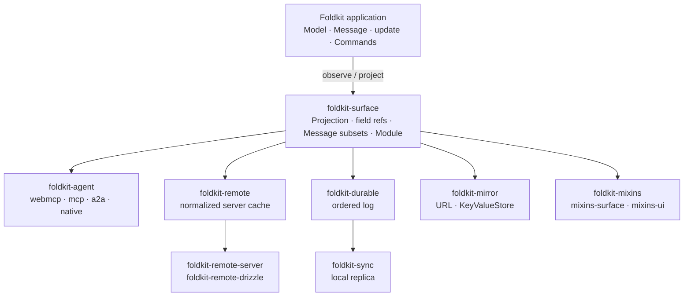

# foldkit-plus

[](https://github.com/doeixd/foldkit-plus/actions/workflows/ci.yml)

> Fifteen packages that extend a [Foldkit](https://foldkit.dev/) application
> outward — to agents, servers, other devices, the URL, and design systems —
> without giving it a second place to keep state.

A Foldkit application is one state machine: a Schema-typed **Model**, a
**Message** union naming everything that can happen, and one pure **`update`**
function that turns a Message into the next Model and some Commands. That shape
is easy to reason about, test, and replay. It gets lost the moment an app grows a
cache in a hook, a store in the URL, a tool handler that re-implements a
transition, or a sync layer with its own reducer.

Everything in this repository keeps the one state machine. An agent can only
send Messages `update` already handles. Server data lives in the Model and is
reconciled by `update`. Replicas replay the same Messages through the same
`update`. The URL and local storage mirror a slice of the Model; they never own
one. Views are styled from outside without forking. Each package answers one
question, and they compose because they all read the same declaration.

## Which package do I need?

| You want to… | Reach for | Read |
| --- | --- | --- |
| Let an LLM or another agent use the app, safely, over MCP, WebMCP, A2A, or Agent Native | `foldkit-agent` + one adapter | [Agents](./docs/agents.md) |
| Cache server entities once, know what is missing, mutate optimistically, get live updates | `foldkit-remote` (+ `-server`, `-drizzle` on the server) | [Server-derived state](./docs/remote.md) |
| Work offline, on several devices, or with other people, and converge | `foldkit-sync` on the client, `foldkit-durable` on the server | [Replicated state](./docs/replication.md) |
| Keep the filter and page in the URL, remember a draft or a preference | `foldkit-mirror` | [Mirrored state](./docs/mirror.md) |
| Restyle or add behaviour to views, including `@foldkit/ui`, without copying markup | `foldkit-mixins` (+ `-surface`, `-ui`) | [View composition](./docs/mixins.md) |
| Say what a feature observes and may cause, and check that nothing owns a field twice | `foldkit-surface` | [package README](./packages/surface) |

Every other package is built on `foldkit-surface`, so it comes along with
whichever you pick.

## The packages

### Start here: `foldkit-surface`

[`foldkit-surface`](./packages/surface) is the observation boundary. From one
`Surface.application({ Model, Message, initial, update })` it derives typed field
references (`App.fields.todos`), pure **Projections** of the Model, typed
**Message subsets**, and feature **Surfaces**: what a part of the UI observes and
which Messages it may cause. Nothing here runs; it is all data, which is why the
other packages can share it. A `Module` collects every contract in an app and
validates that each field has one owner and every Message one home.

**Use it when** two things need to agree on a slice of the Model: a view and an
agent, a view and a replica, a feature and its tests.

### Agents

[`foldkit-agent`](./packages/agent) turns a Model projection and a chosen subset
of the Message union into an agent contract: what an agent may **see** and what
it may **do**. Capabilities are Messages, so an agent cannot do anything the app
cannot; `available`, `authorize`, typed input, and a **completion** contract
(the call is done when the correlated fact is applied) live on the contract, and
an audit log records every decision. Four adapters serve that one contract:
[`foldkit-agent-webmcp`](./packages/agent-webmcp) in the page through
`document.modelContext`, [`foldkit-agent-mcp`](./packages/agent-mcp) over stdio
or Streamable HTTP, [`foldkit-agent-a2a`](./packages/agent-a2a) as an Agent Card
with tasks, and [`foldkit-agent-native`](./packages/agent-native) as Agent Native
actions.

**Use it when** you want an assistant, a copilot, or another service to drive
the app through the same transitions a human does. **Not for** driving the DOM;
if the behaviour is not a Message, add one.

### Server-derived state

[`foldkit-remote`](./packages/remote) is a normalized cache of server data,
stored **inside the Model** as a Submodel: entities once by identity, field
presence tracked (missing, `null`, stale, and not-found are different), and
connections with honest gaps. A Surface's projection carries its requirements;
a planner diffs them against the store and fetches only what is missing;
mutations are optimistic layers released by request id; live changes arrive with
cursors. [`foldkit-remote-server`](./packages/remote-server) compiles entity,
query, mutation, and live sources with per-principal authorization into Effect
RPC handlers, and [`foldkit-remote-drizzle`](./packages/remote-drizzle) compiles
the selections and queries to Drizzle.

**Use it when** the app shows data another system owns and you are tired of
per-view fetching, double fetches, and "is this field missing or null?".
**Not for** state the user authors offline; that is Sync.

### Replicated state

[`foldkit-durable`](./packages/durable) is a durable, ordered operation log on
SQLite through `effect/unstable/sql`: idempotent append, a snapshot and cursor
per document, compaction, a change stream, and a durable **effect ledger** with
a recovery worker. [`foldkit-sync`](./packages/sync) is the local-first replica:
a persisted outbox, an optimistic projection, reconciliation against the
server's order, presence, and a reconnecting WebSocket transport. One
declaration derives both halves, replay is the application's own `update` on
the shared slice, and `Sync.mount` runs the app over a replica in the browser.

**Use it when** clients must keep working offline and converge later, or a
server-side agent acts on the same state a user sees. **Not for** peer-to-peer
CRDTs; this is server-ordered, single-writer-per-document.

### Mirrored state

[`foldkit-mirror`](./packages/mirror) keeps a slice of the Model in step with the
**URL** query string or Effect's **`KeyValueStore`**: the filter, page, and
search text a link should carry; the draft or collapsed sidebar a device should
remember. Defaults, batching, codecs, and links are derived from the app, back
and forward cannot loop, and a mirror observes fields without owning them.

**Use it when** local state should be linkable or survive a reload. **Not for**
anything two tabs must agree on; a mirror is last-write-wins with no log.

### View composition

[`foldkit-mixins`](./packages/mixins) lets a view publish the structural points
it is willing to customize, and lets **Style** (appearance as data) and
**Behavior** (attributes plus an optional Mount) attach from outside. One
resolver merges them and refuses two owners of one event.
[`foldkit-mixins-surface`](./packages/mixins-surface) renders a Surface's
projection through such a view, and [`foldkit-mixins-ui`](./packages/mixins-ui)
adapts `@foldkit/ui` components that expose their attribute bundles.

**Use it when** a design system meets components it did not write. **Not for**
state: a Behavior that "needs state" wants a Submodel.

## How they fit together



None of them reimplements `update`. The agent layer projects it, Remote reduces
its facts through it, Sync replays the same Messages through it, a mirror's
`reduce` is a pure Model function the app calls from it, and Mixins never touch
state at all.

The rule that makes this composable is **one owner per datum**. Every piece of
state has one authoritative owner, and `Module.validate` reports a second:

| State | Owner | Package |
| --- | --- | --- |
| The route, the selection, a transient error | the local Model, plain `update` | — |
| A filter the URL shows, a draft a device remembers | the local Model | `foldkit-mirror` (observes) |
| A cache of another system's facts | the server | `foldkit-remote` |
| Client-authored state that must converge | the durable log | `foldkit-sync` + `foldkit-durable` |
| What an agent may see and do | the application | `foldkit-agent` (observes, exposes) |

## Sixty seconds of code

From the [todo app](./examples/todo-app), which wires every package into one
application. One declaration; every contract is derived from it:

```ts
import { Agent } from 'foldkit-agent'
import { Mirror } from 'foldkit-mirror'
import { MessageSet, Module, Projection, Surface } from 'foldkit-surface'
import { DocumentId, Sync } from 'foldkit-sync'

// The application: an ordinary Model, Message union, and update.
const App = Surface.application({ Model, Message, initial, update })

// What the board renders, and the only Messages it may cause.
const Board = App.surface('Board', {
  model: ({ model }) => ({ todos: model.todos, filter: model.filter }),
  messages: [Message.ToggledTodo, Message.DeletedTodo],
})

// What replicates: this slice, changed by these Messages, replayed through update.
const TodoSync = Sync.forApplication(App).make({
  documentId: DocumentId.make('todos'),
  shared: Projection.pick(App.fields.todos),
  durable: MessageSet.make(App, [Message.SubmittedTodo, Message.ToggledTodo, Message.DeletedTodo]),
})

// What an agent may see (a Surface) and do (Messages update already handles).
const TodoAgent = Agent.forApplication(App)
const AppAgent = TodoAgent.make({
  context: Board,
  messages: TodoAgent.expose(Message, {
    ToggledTodo: { name: 'toggle_todo', description: 'Mark a todo done, or undo that' },
  }),
})

// What the URL shows. Reduced back into the Model on navigation.
const Filters = Mirror.url(App, { fields: [App.fields.filter] })

// The application as data: one owner per field, every Message accounted for.
Module.validate(Module.make(App, [Board, TodoSync, AppAgent, Filters.contract])) // []
```

The same `update` serves the view, the replica, the agent, and the journal on
the server; `TodoSync.journalContract()` hands the server its codecs, reducer,
and authorization rules, so nothing is declared twice. That sample is
type-checked in
[`examples/todo-app/test/readme.test-d.ts`](./examples/todo-app/test/readme.test-d.ts),
so it cannot drift from the API.

## Install

```bash
pnpm add foldkit-agent                       # the contract
pnpm add foldkit-agent foldkit-agent-webmcp  # browser (WebMCP)
pnpm add foldkit-agent foldkit-agent-mcp     # external MCP
pnpm add foldkit-agent foldkit-agent-a2a     # A2A
pnpm add foldkit-agent foldkit-agent-native  # Agent Native
pnpm add foldkit-durable foldkit-sync        # offline, multiplayer, remote-agent state
pnpm add foldkit-surface foldkit-remote      # projections; normalized server state
pnpm add foldkit-remote-server foldkit-remote-drizzle  # the server side of Remote
pnpm add foldkit-mirror                      # a Model slice in the URL or a key-value store
pnpm add foldkit-mixins foldkit-mixins-surface foldkit-mixins-ui  # slot contracts for views
```

`foldkit` and `effect` are peer dependencies. Foldkit `0.158.2` peer-depends on
`effect@4.0.0-rc.112`, so these packages target Effect 4. `foldkit-durable`
requires Node 22 for `node:sqlite`. The [release matrix](./docs/releases.md)
lists every package's version.

## Examples

- [`examples/todo-app`](./examples/todo-app) — **start here.** A local-first,
  agent-ready todo list that explains each choice: a SQLite journal, two
  browser tabs converging, owner-only rules, WebMCP tools, a linkable filter,
  and a styled view. `pnpm dev` runs it in a browser.
- [`examples/kitchen-sink`](./examples/kitchen-sink) — every package but the
  mirror in one in-process transcript, no server and no browser.
- [`examples/todo`](./examples/todo) — `foldkit-agent` alone, with a hand-written
  host.
- [`examples/sync`](./examples/sync), [`examples/remote`](./examples/remote),
  [`examples/mixins`](./examples/mixins) — one extension each.

Every example prints a transcript that its test pins line by line; `pnpm demo`
runs them all.

## Guides

- [Agents](./docs/agents.md) — `foldkit-agent` and its adapters: what an agent
  may see and do, and why a capability is a Message.
- [Server-derived state](./docs/remote.md) — the `foldkit-surface` boundary and
  the `foldkit-remote` Submodel.
- [Replicated state](./docs/replication.md) — what `foldkit-durable` and
  `foldkit-sync` do, and when to reach for them.
- [Mirrored state](./docs/mirror.md) — a Model slice in the URL or a key-value
  store, and why a mirror is not an owner.
- [Inside-out view composition](./docs/mixins.md) — slot contracts, Style and
  Behavior, and the `@foldkit/ui` adapters.
- [Runtime binding](./docs/sync-runtime-binding.md) — how `Sync.mount` runs an
  application over a replica, and routes the URL.
- [Releases](./docs/releases.md) — the version and publish matrix for every
  workspace package.
- [Revision plan](./docs/design/REVISION_PLAN.md) — the full design and phase status.
- [All guides](./docs/README.md), including the [improvement suggestions](./docs/improvements.md).
- Each package README documents its API.

## Status

These are `0.x` packages tracking a `0.x` framework and an Effect release
candidate, so APIs are still settling and minor versions may break; the
[CHANGELOG](./CHANGELOG.md) says what changed and why. What is here is tested:
every package has a suite, every example is an asserted transcript that CI
runs, and the guards in the pure cores were mutation-tested as they were
written (see [AGENTS.md](./AGENTS.md)). Issues and design discussion are
welcome; the [revision plan](./docs/design/REVISION_PLAN.md) records where each
package is heading.

## Repository layout

```text
packages/surface          foldkit-surface
packages/agent            foldkit-agent
packages/agent-webmcp     foldkit-agent-webmcp
packages/agent-mcp        foldkit-agent-mcp
packages/agent-a2a        foldkit-agent-a2a
packages/agent-native     foldkit-agent-native
packages/remote           foldkit-remote
packages/remote-server    foldkit-remote-server
packages/remote-drizzle   foldkit-remote-drizzle
packages/durable          foldkit-durable
packages/sync             foldkit-sync
packages/mirror           foldkit-mirror
packages/mixins           foldkit-mixins
packages/mixins-surface   foldkit-mixins-surface
packages/mixins-ui        foldkit-mixins-ui
examples/todo-app         the todo app: a local-first, agent-ready application
examples/kitchen-sink     fourteen packages wired in-process, as a deterministic transcript
examples/todo             foldkit-agent, driven by a human and by an agent over WebMCP
examples/sync             durable messages and ordered replication
examples/remote           normalized server state, end to end
examples/mixins           view mixins, end to end
```

## Development

```bash
pnpm install
pnpm test        # vitest
pnpm typecheck   # tsc -b
pnpm build       # tsdown
pnpm demo        # run the worked examples
pnpm format      # prettier
pnpm pack:check  # verify every package packs
```

See [CONTRIBUTING.md](./CONTRIBUTING.md) for the checks before a commit, and
[AGENTS.md](./AGENTS.md) for the working agreements.

## Releasing

Every package under `packages/*` publishes; the
[release matrix](./docs/releases.md) lists each one's version. `pnpm release`
builds, then publishes every non-`private` package, skipping versions the
registry already has. Publishing must use **pnpm**, not npm: the packages declare
each other as `workspace:` dependencies, which pnpm rewrites to real ranges when
it packs.

Bump the versions, add a [CHANGELOG.md](./CHANGELOG.md) entry, run the four
checks, then push a `vX.Y.Z` tag. The
[release workflow](./.github/workflows/release.yml) re-runs the checks. It
publishes with provenance when the `NPM_TOKEN` repository secret is set, and
otherwise runs the checks and skips publishing.

## License

MIT. These are community packages, published unscoped as Foldkit itself is. They
are not affiliated with or endorsed by the Foldkit maintainers, and the names are
theirs for the asking.

## References

- Foldkit — <https://foldkit.dev/> · <https://github.com/foldkit/foldkit>
- WebMCP — <https://github.com/webmachinelearning/webmcp>
- Agent Native — <https://github.com/BuilderIO/agent-native>
