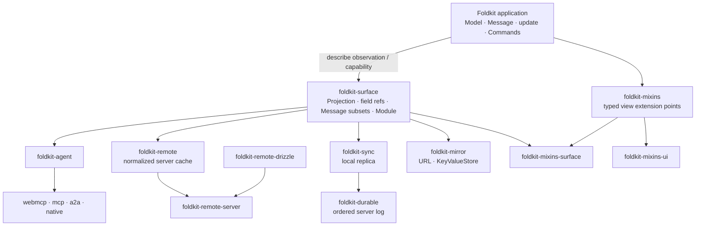

# foldkit-plus

[](https://github.com/doeixd/foldkit-plus/actions/workflows/ci.yml)

> Fifteen packages that extend a [Foldkit](https://foldkit.dev/) application
> outward — to agents, servers, other devices, the URL, and design systems —
> without giving it a second place to keep state.

A Foldkit application is one state machine: a Schema-typed **Model**, a
**Message** union naming everything that can happen, and one pure **`update`**
function that turns a Message into the next Model and some Commands. That shape
is easy to reason about, test, and replay. It gets lost the moment an app grows a
cache in a hook, a store in the URL, a tool handler that re-implements a
transition, or a sync layer with its own reducer.

Everything in this repository keeps the one state machine. An agent can only
send Messages `update` already handles. Server data lives in the Model and is
reconciled by `update`. Replicas replay the same Messages through the same
`update`. The URL and local storage mirror a slice of the Model; they never own
one. Views are styled from outside without forking. Each package answers one
question, and they compose because they meet at explicit application boundaries.

## Sixty seconds of code

The fastest way to understand Foldkit Plus is to watch several packages reuse
one application declaration. Assume `Model`, `Message`, `initial`, and `update`
are an ordinary Foldkit app you already wrote. Everything around them derives
from the same state machine; none of it introduces a second reducer.

For the Remote portion below, that ordinary app has one extra field and one set
of Message cases: `remote: Remote.Model` starts as `Remote.initial`,
`...Remote.messages` is part of the application's Message union, and `update`
hands those Messages to the bound Remote domain's `reduce`. The type-checked
fixture linked below includes that wiring explicitly.

```ts
import { Schema } from 'effect'
import { Agent } from 'foldkit-agent'
import { Mirror } from 'foldkit-mirror'
import { Capability, Slot, Slots, Style } from 'foldkit-mixins'
import { SurfaceView } from 'foldkit-mixins-surface'
import { Entity, Remote } from 'foldkit-remote'
import { MessageSet, Module, Projection, Surface } from 'foldkit-surface'
import { DocumentId, Sync } from 'foldkit-sync'

type Principal = { readonly role: 'owner' | 'guest' }
const isOwner = (principal: Principal) => principal.role === 'owner'

// 1. This is still the application: one Model, one Message union, one update.
// Surface adds typed references and inspection metadata; it does not add runtime state.
const App = Surface.application({ Model, Message, initial, update })

// 2. A Surface is a public boundary for a feature: what it may observe and cause.
// A renderer bound to Board can only construct these two Messages.
const Board = App.surface('Board', {
  model: ({ model }) => ({ todos: model.todos, filter: model.filter }),
  messages: [Message.ToggledTodo, Message.DeletedTodo],
})

// A read-only Surface can be reused by something that only needs context.
const Overview = App.surface('Overview', {
  model: ({ model }) => ({ todos: model.todos, filter: model.filter }),
})

// 3. Remote is for facts another system owns. First describe the server shape.
// This is not another client Model; it is a typed description of a server entity.
const ProjectEntity = Entity.make(
  'Project',
  Schema.Struct({ id: Schema.String, name: Schema.String, status: Schema.String }),
)
const ProjectSummary = ProjectEntity.select({ id: true, name: true, status: true })

// Bind that server domain to the `remote` field already embedded in App.Model.
// Remote's normalized cache therefore lives *inside* the application Model,
// rather than in React Query, a hook cache, or some second mutable store.
const Data = Remote.make({
  model: App.model.remote,
  entities: [ProjectEntity],
})

// `Data.get` is a pure Projection, not a network request. It says:
// "this Surface needs these fields of this Project id" and reads whatever the
// current Model already knows as a RemoteData value.
const ProjectPage = App.surface('ProjectPage', {
  params: { projectId: Schema.String },
  model: ({ params }) => ({
    project: Data.get(ProjectSummary, params.projectId),
  }),
})

// That `project` value is explicit about cache state:
// Initial | Loading | Ready | Refreshing | Failed | NotFound.
// A view can render it without ever performing I/O during render.
//
// Network work is derived separately from *active* Surfaces. If ProjectPage is
// active, Remote compares its requirements with the Model, fetches only missing
// fields through RemoteClient, and retains what the page reaches. If everything
// is already known, this schedules no read. When a response arrives, it is a
// Remote Message, and the application's own update -> Data.reduce path stores it.
Data.subscriptions({
  project: Surface.at(ProjectPage, model => ({ projectId: model.projectId })),
})

// Data.contract tells Module that this Remote domain owns the `remote` Model path.
// The server still owns the *facts* represented there; Remote owns their local cache.

// 4. Mixins separate "where customization is allowed" from "what gets attached there."
//
// BoardSlots is the view's public customization contract. It renders nothing by
// itself. It only names the places the view agrees other code may extend later:
// `root` will be the outer <section>; `list` will be the <ul>.
// Capabilities describe what kind of element lives at each point so incompatible
// Styles or Behaviors can be rejected instead of silently doing the wrong thing.
const BoardSlots = Slots.define({
  root: Slot.make({ capability: Capability.Container }),
  list: Slot.make({ capability: Capability.Collection }),
})

// Style is data written against that slot contract. Nothing is applied yet, and
// BoardStyle cannot read or change application state. Because it is created with
// `forSlots(BoardSlots)`, misspelling a slot or styling one Board never published
// is a type error rather than a convention.
const BoardStyle = Style.forSlots(BoardSlots)({
  root: Style.class('todo-board'), // contribute a class to the `root` slot
  list: Style.inline({ margin: '0', padding: '0', listStyle: 'none' }), // style `list`
})

// SurfaceView.define ties three boundaries together:
//   Board      -> the projected Model this view receives and the Messages it may emit
//   BoardSlots -> the places outside customization may attach
//   render fn  -> the actual markup
//
// So `model` is not the whole application Model; it is Board's { todos, filter }.
// And `h` is typed to the Messages Board declared above.
export const BoardView = SurfaceView.define(Board, BoardSlots, (model, slots, h) =>
  h.section(
    // `.attrs()` is the handoff point between markup and Mixins. It resolves the
    // view's own attributes plus every Style/Behavior attached to `root` into
    // ordinary Foldkit attributes for this <section>.
    slots.root.attrs(),
    [
      h.ul(
        // Same idea here: this exact DOM position is the published `list` slot.
        slots.list.attrs(),
        model.todos.map(todo => h.li([], [todo.title])),
      ),
    ],
  ),
).pipe(
  // Attach appearance from the outside. BoardView never imports CSS decisions into
  // its markup, so styles can be swapped/composed without copying the component or
  // adding a growing collection of styling props.
  Style.attach(BoardStyle),
)

// Behavior can attach element-level interaction through those same slots. It may
// contribute attributes, event handlers, or a Mount, but it still owns no Model;
// application state and transitions remain Model / Message / update.

// 5. Sync solves a different ownership problem. Remote caches server-owned facts;
// Sync replicates application-owned facts that must survive offline work and converge.
// Projection.pick is writable because checkpoints must install the shared slice
// back into Model; replay still runs these Messages through the application's update.
const TodoSync = Sync.forApplication(App)
  .withPrincipal<Principal>()
  .make({
    documentId: DocumentId.make('todos'),
    shared: Projection.pick(App.fields.todos),
    durable: MessageSet.make(App, [
      Message.SubmittedTodo,
      Message.ToggledTodo,
      Message.DeletedTodo,
    ]),
    authorize: {
      // Policy lives on the contract and is enforced by the server journal.
      DeletedTodo: ({ principal }) => isOwner(principal),
    },
  })

// The server gets codecs, empty snapshot, replay, and authorization from Sync.
// There is no second server-side reducer to keep in agreement.
TodoSync.journalContract()

// 6. First specialize the Agent API to this application and Principal type.
// `forApplication(...).withPrincipal(...)` does NOT create an agent; it creates
// a typed builder whose helpers know App's Model, Message union, and Principal.
const AgentBuilder = Agent.forApplication(App).withPrincipal<Principal>()

// `make` creates the concrete agent contract that MCP/WebMCP/A2A/etc. can serve:
// what this agent sees, which existing Messages it may cause, and their policy.
const AssistantAgent = AgentBuilder.make({
  context: Overview,
  messages: AgentBuilder.expose(Message, {
    RequestedTodo: Agent.variant({
      name: 'add_todo',
      description: 'Add a todo with the given title',

      // The protocol input can be smaller than the internal Message.
      input: Schema.Struct({ title: Schema.String }),
      toMessage: ({ title }) => ({ title }),

      // RequestedTodo is an intent. The tool call completes when update later
      // applies the correlated durable fact produced by the application's Command.
      completion: {
        success: Message.SubmittedTodo,
        correlate: (request, result) => request.title.trim() === result.title,
      },
    }),
    ToggledTodo: { name: 'toggle_todo', description: 'Toggle a todo' },
    DeletedTodo: {
      name: 'delete_todo',
      description: 'Delete a todo (owner only)',
      // Same rule, checked early at the agent boundary; the journal still owns trust.
      authorize: ({ principal }) => isOwner(principal),
    },
  }),
})

// 7. Mirrors do not own state. They are secondary representations of Model fields.
const Filters = Mirror.url(App, {
  name: 'filters',
  fields: [App.fields.filter], // linkable: ?filter=active
})
const Prefs = Mirror.kv(App, {
  key: 'todo/prefs',
  fields: [App.fields.draft], // remembered on this device
})

// 8. The architecture itself is data. Each subsystem contributes its contract;
// Module can now see that Remote owns `remote`, Sync owns its shared slice, and
// the other features only observe/expose what they declared.
const Project = Module.make(App, [
  Board,
  Overview,
  ProjectPage,
  Data.contract,
  TodoSync,
  AssistantAgent,
  Filters.contract,
  Prefs.contract,
])

Module.validate(Project) // []
Module.toMermaid(Project) // architecture generated from the declarations above
```

Read the Remote part as **server shape → local cache binding → pure projection →
runtime subscriptions**. `ProjectEntity` describes data the server owns;
`Remote.make` says where the normalized cache lives in the application Model;
`Data.get` contributes requirements to a Projection without fetching; and
`Data.subscriptions` turns the requirements of active Surfaces into reads, live
subscriptions, and retention. Responses return as Messages and are reduced by
the same application `update`. Remote is therefore not a second source of truth:
the server owns the facts, and the Foldkit Model owns the local representation
of what the application currently knows about them.

That is also why Remote and Sync are separate. **Remote is for server-owned
facts you can refetch. Sync is for application-owned facts that must be durable
and converge.** A project record from your API belongs in Remote; a todo edited
offline by this application may belong in Sync.

Read the Mixins part from left to right: `Board` defines the state/Message
boundary, `BoardSlots` defines the supported customization points, `BoardStyle`
is pure attachment data for those points, and `BoardView` maps Board's projected
Model to markup. Each `slots.*.attrs()` call marks the exact element where an
attachment is allowed to land. `Style.attach(BoardStyle)` then composes the
appearance from outside the view. The result is still ordinary Foldkit markup
and attributes; Mixins adds neither another state container nor another render
loop.

A useful naming rule for Agent code is **builder first, contract second**:
`Agent.forApplication(App)` (optionally followed by `withPrincipal`) specializes
the API to your application; it does not describe any particular agent. Calling
`.make(...)` on that builder produces the actual protocol-neutral agent contract.
In the example, `AgentBuilder` is the former and `AssistantAgent` is the latter.
Adapters bind or serve `AssistantAgent`; `AgentBuilder` is just the typed DSL used
to construct it.

The important part is what is **missing**: no agent reducer, sync reducer,
React-query-style cache, URL store, persistence state machine, server copy of the
shared schema, or forked component just to restyle it. The same `update` remains
the transition function throughout; Remote stores server knowledge in the Model
and Mixins never becomes another state owner.

The Remote section above intentionally stops before transport, queries,
optimistic mutations, pagination, and live events so the front-page example
still fits in one reading. [`examples/remote`](./examples/remote) shows that
whole path end to end. [`examples/todo-app`](./examples/todo-app) contains the
fuller Surface, Sync, Agent, Mirror, and Mixins composition used by the rest of
the sample, while [`examples/kitchen-sink`](./examples/kitchen-sink) shows the
broadest in-process integration.

The sample above is type-checked in
[`examples/todo-app/test/readme.test-d.ts`](./examples/todo-app/test/readme.test-d.ts),
so the front page cannot quietly drift from the API.

## Start here

If the package count looks larger than the idea, start with the idea rather than
the package list:

1. **Your Foldkit application stays the center.** Model, Message, `update`,
   Commands, Submodels, and Mounts still mean what they mean in Foldkit.
2. **`foldkit-surface` describes boundaries.** A Projection says what a feature
   observes; a Message subset says what it may cause. Agent, Remote, Sync, and
   Mirror can derive work from those declarations.
3. **The other packages are interpreters and adapters.** They expose Messages to
   agents, reconcile server facts, replicate a Model slice, mirror local state,
   or customize views without creating another application state machine.

For a concrete application, start with [`examples/todo-app`](./examples/todo-app).
It shows the app-facing stack in a real browser. For the broadest integration
trace, use [`examples/kitchen-sink`](./examples/kitchen-sink); together those two
examples cover all fifteen packages. The [examples index](./examples/README.md)
says which example to read for each subsystem.

## Which package do I need?

| You want to… | Reach for | Read |
| --- | --- | --- |
| Let an LLM or another agent use the app, safely, over MCP, WebMCP, A2A, or Agent Native | `foldkit-agent` + one adapter | [Agents](./docs/agents.md) |
| Cache server entities once, know what is missing, mutate optimistically, get live updates | `foldkit-remote` (+ `-server`, `-drizzle` on the server) | [Server-derived state](./docs/remote.md) |
| Work offline, on several devices, or with other people, and converge | `foldkit-sync` on the client, `foldkit-durable` on the server | [Replicated state](./docs/replication.md) |
| Keep the filter and page in the URL, remember a draft or a preference | `foldkit-mirror` | [Mirrored state](./docs/mirror.md) |
| Restyle or add behaviour to views, including `@foldkit/ui`, without copying markup | `foldkit-mixins` (+ `-surface`, `-ui`) | [View composition](./docs/mixins.md) |
| Say what a feature observes and may cause, and check that nothing owns a field twice | `foldkit-surface` | [package README](./packages/surface) |

`foldkit-surface` is the shared semantic seam for Agent, Remote, Sync, Mirror,
and the Surface/Mixins bridge. It is not a mandatory base class for the whole
repository: `foldkit-durable`, core `foldkit-mixins`, and the protocol/UI
adapters can stand on their own and meet the Surface-backed packages at explicit
boundaries.

## The packages

### Start here: `foldkit-surface`

[`foldkit-surface`](./packages/surface) is the observation boundary. From one
`Surface.application({ Model, Message, initial, update })` it derives typed field
references (`App.fields.todos`), pure **Projections** of the Model, typed
**Message subsets**, and feature **Surfaces**: what a part of the UI observes and
which Messages it may cause. Nothing here runs; it is all data, which is why the
other packages can share it. A `Module` collects every contract in an app and
validates that each field has one owner and every Message one home.

**Use it when** two things need to agree on a slice of the Model: a view and an
agent, a view and a replica, a feature and its tests.

### Agents

[`foldkit-agent`](./packages/agent) turns a Model projection and a chosen subset
of the Message union into an agent contract: what an agent may **see** and what
it may **do**. Capabilities are Messages, so an agent cannot do anything the app
cannot; `available`, `authorize`, typed input, and a **completion** contract
(the call is done when the correlated fact is applied) live on the contract, and
an audit log records every decision. Four adapters serve that one contract:
[`foldkit-agent-webmcp`](./packages/agent-webmcp) in the page through
`document.modelContext`, [`foldkit-agent-mcp`](./packages/agent-mcp) over stdio
or Streamable HTTP, [`foldkit-agent-a2a`](./packages/agent-a2a) as an Agent Card
with tasks, and [`foldkit-agent-native`](./packages/agent-native) as Agent Native
actions.

**Use it when** you want an assistant, a copilot, or another service to drive
the app through the same transitions a human does. **Not for** driving the DOM;
if the behaviour is not a Message, add one.

### Server-derived state

[`foldkit-remote`](./packages/remote) is a normalized cache of server data,
stored **inside the Model** as a Submodel: entities once by identity, field
presence tracked (missing, `null`, stale, and not-found are different), and
connections with honest gaps. A Surface's projection carries its requirements;
a planner diffs them against the store and fetches only what is missing;
mutations are optimistic layers released by request id; live changes arrive with
cursors. [`foldkit-remote-server`](./packages/remote-server) compiles entity,
query, mutation, and live sources with per-principal authorization into Effect
RPC handlers, and [`foldkit-remote-drizzle`](./packages/remote-drizzle) compiles
the selections and queries to Drizzle.

**Use it when** the app shows data another system owns and you are tired of
per-view fetching, double fetches, and "is this field missing or null?".
**Not for** state the user authors offline; that is Sync.

### Replicated state

[`foldkit-durable`](./packages/durable) is a durable, ordered operation log on
SQLite through `effect/unstable/sql`: idempotent append, a snapshot and cursor
per document, compaction, a change stream, and a durable **effect ledger** with
a recovery worker. [`foldkit-sync`](./packages/sync) is the local-first replica:
a persisted outbox, an optimistic projection, reconciliation against the
server's order, presence, and a reconnecting WebSocket transport. One
declaration derives both halves, replay is the application's own `update` on
the shared slice, and `Sync.mount` runs the app over a replica in the browser.

**Use it when** clients must keep working offline and converge later, or a
server-side agent acts on the same state a user sees. **Not for** peer-to-peer
CRDTs; this is server-ordered, single-writer-per-document.

### Mirrored state

[`foldkit-mirror`](./packages/mirror) keeps a slice of the Model in step with the
**URL** query string or Effect's **`KeyValueStore`**: the filter, page, and
search text a link should carry; the draft or collapsed sidebar a device should
remember. Defaults, batching, codecs, and links are derived from the app, back
and forward cannot loop, and a mirror observes fields without owning them.

**Use it when** local state should be linkable or survive a reload. **Not for**
anything two tabs must agree on; a mirror is last-write-wins with no log.

### View composition

[`foldkit-mixins`](./packages/mixins) lets a view publish the structural points
it is willing to customize, and lets **Style** (appearance as data) and
**Behavior** (attributes plus an optional Mount) attach from outside. One
resolver merges them and refuses two owners of one event.
[`foldkit-mixins-surface`](./packages/mixins-surface) renders a Surface's
projection through such a view, and [`foldkit-mixins-ui`](./packages/mixins-ui)
adapts `@foldkit/ui` components that expose their attribute bundles.

**Use it when** a design system meets components it did not write. **Not for**
state: a Behavior that "needs state" wants a Submodel.

## How they fit together



None of them reimplements `update`. The agent layer projects it, Remote reduces
its facts through it, Sync replays the same Messages through it, a mirror's
`reduce` is a pure Model function the app calls from it, and Mixins never touch
state at all. Durable is the server-side ordered log Sync can derive a contract
for; it does not need Surface when used independently.

The rule that makes this composable is **one owner per datum**. Every piece of
state has one authoritative owner, and `Module.validate` reports a second:

| State | Owner | Package |
| --- | --- | --- |
| The route, the selection, a transient error | the local Model, plain `update` | — |
| A filter the URL shows, a draft a device remembers | the local Model | `foldkit-mirror` (observes) |
| A cache of another system's facts | the server | `foldkit-remote` |
| Client-authored state that must converge | the durable log | `foldkit-sync` + `foldkit-durable` |
| What an agent may see and do | the application | `foldkit-agent` (observes, exposes) |

## Install

```bash
pnpm add foldkit-agent                       # the contract
pnpm add foldkit-agent foldkit-agent-webmcp  # browser (WebMCP)
pnpm add foldkit-agent foldkit-agent-mcp     # external MCP
pnpm add foldkit-agent foldkit-agent-a2a     # A2A
pnpm add foldkit-agent foldkit-agent-native  # Agent Native
pnpm add foldkit-durable foldkit-sync        # offline, multiplayer, remote-agent state
pnpm add foldkit-surface foldkit-remote      # projections; normalized server state
pnpm add foldkit-remote-server foldkit-remote-drizzle  # the server side of Remote
pnpm add foldkit-mirror                      # a Model slice in the URL or a key-value store
pnpm add foldkit-mixins foldkit-mixins-surface foldkit-mixins-ui  # slot contracts for views
```

`foldkit` and `effect` are peer dependencies. Foldkit `0.158.2` peer-depends on
`effect@4.0.0-rc.112`, so these packages target Effect 4. `foldkit-durable`
requires Node 22 for `node:sqlite`. The [release matrix](./docs/releases.md)
lists every package's version.

## Examples

- [`examples/todo-app`](./examples/todo-app) — **start here.** A local-first,
  agent-ready todo list that explains each choice: a SQLite journal, two
  browser tabs converging, owner-only rules, WebMCP tools, a linkable filter,
  and a styled view. `pnpm dev` runs it in a browser.
- [`examples/kitchen-sink`](./examples/kitchen-sink) — every package but the
  mirror in one in-process transcript, no server and no browser.
- [`examples/todo`](./examples/todo) — `foldkit-agent` alone, with a hand-written
  host.
- [`examples/sync`](./examples/sync), [`examples/remote`](./examples/remote),
  [`examples/mixins`](./examples/mixins) — one extension each.

Every example prints a transcript that its test pins line by line; `pnpm demo`
runs them all. See [`examples/README.md`](./examples/README.md) for the reading
order and what each example is meant to prove.

## Guides

- [Agents](./docs/agents.md) — `foldkit-agent` and its adapters: what an agent
  may see and do, and why a capability is a Message.
- [Server-derived state](./docs/remote.md) — the `foldkit-surface` boundary and
  the `foldkit-remote` Submodel.
- [Replicated state](./docs/replication.md) — what `foldkit-durable` and
  `foldkit-sync` do, and when to reach for them.
- [Mirrored state](./docs/mirror.md) — a Model slice in the URL or a key-value
  store, and why a mirror is not an owner.
- [Inside-out view composition](./docs/mixins.md) — slot contracts, Style and
  Behavior, and the `@foldkit/ui` adapters.
- [Runtime binding](./docs/sync-runtime-binding.md) — how `Sync.mount` runs an
  application over a replica, and routes the URL.
- [Releases](./docs/releases.md) — the version and publish matrix for every
  workspace package.
- [Revision plan](./docs/design/REVISION_PLAN.md) — the full design and phase status.
- [Documentation map](./docs/README.md) — the recommended reading order, task guides,
  package references, and design notes.
- Each package README documents its API.

## Status

These are `0.x` packages tracking a `0.x` framework and an Effect release
candidate, so APIs are still settling and minor versions may break; the
[CHANGELOG](./CHANGELOG.md) says what changed and why. What is here is tested:
every package has a suite, every example is an asserted transcript that CI
runs, and the guards in the pure cores were mutation-tested as they were
written (see [AGENTS.md](./AGENTS.md)). Issues and design discussion are
welcome; the [revision plan](./docs/design/REVISION_PLAN.md) records where each
package is heading.

## Repository layout

```text
packages/surface          foldkit-surface
packages/agent            foldkit-agent
packages/agent-webmcp     foldkit-agent-webmcp
packages/agent-mcp        foldkit-agent-mcp
packages/agent-a2a        foldkit-agent-a2a
packages/agent-native     foldkit-agent-native
packages/remote           foldkit-remote
packages/remote-server    foldkit-remote-server
packages/remote-drizzle   foldkit-remote-drizzle
packages/durable          foldkit-durable
packages/sync             foldkit-sync
packages/mirror           foldkit-mirror
packages/mixins           foldkit-mixins
packages/mixins-surface   foldkit-mixins-surface
packages/mixins-ui        foldkit-mixins-ui
examples/todo-app         the todo app: a local-first, agent-ready application
examples/kitchen-sink     fourteen packages wired in-process, as a deterministic transcript
examples/todo             foldkit-agent, driven by a human and by an agent over WebMCP
examples/sync             durable messages and ordered replication
examples/remote           normalized server state, end to end
examples/mixins           view mixins, end to end
```

## Development

```bash
pnpm install
pnpm test        # vitest
pnpm typecheck   # tsc -b
pnpm build       # tsdown
pnpm demo        # run the worked examples
pnpm format      # prettier
pnpm pack:check  # verify every package packs
```

See [CONTRIBUTING.md](./CONTRIBUTING.md) for the checks before a commit, and
[AGENTS.md](./AGENTS.md) for the working agreements.

## Releasing

Every package under `packages/*` publishes; the
[release matrix](./docs/releases.md) lists each one's version. `pnpm release`
builds, then publishes every non-`private` package, skipping versions the
registry already has. Publishing must use **pnpm**, not npm: the packages declare
each other as `workspace:` dependencies, which pnpm rewrites to real ranges when
it packs.

Bump the versions, add a [CHANGELOG.md](./CHANGELOG.md) entry, run the four
checks, then push a `vX.Y.Z` tag. The
[release workflow](./.github/workflows/release.yml) re-runs the checks. It
publishes with provenance when the `NPM_TOKEN` repository secret is set, and
otherwise runs the checks and skips publishing.

## License

MIT. These are community packages, published unscoped as Foldkit itself is. They
are not affiliated with or endorsed by the Foldkit maintainers, and the names are
theirs for the asking.

## References

- Foldkit — <https://foldkit.dev/> · <https://github.com/foldkit/foldkit>
- WebMCP — <https://github.com/webmachinelearning/webmcp>
- Agent Native — <https://github.com/BuilderIO/agent-native>