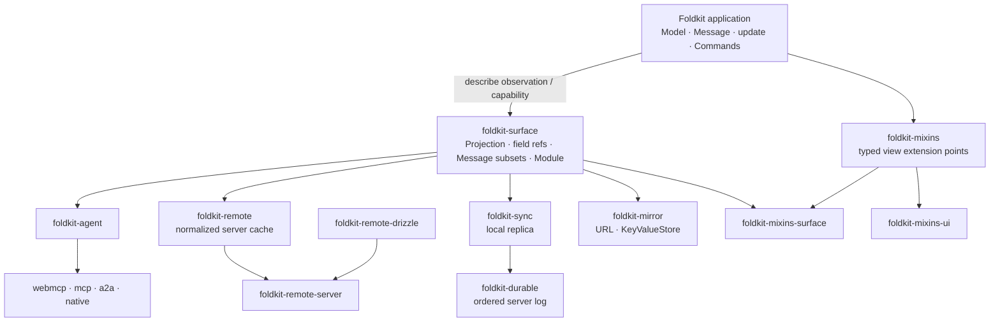

# foldkit-plus

[](https://github.com/doeixd/foldkit-plus/actions/workflows/ci.yml) [](https://deepwiki.com/doeixd/foldkit-plus)

> Fifteen packages that extend a [Foldkit](https://foldkit.dev/) application
> outward — to agents, servers, other devices, the URL, and design systems —
> without giving it a second place to keep state.

A Foldkit application is one state machine: a Schema-typed **Model**, a
**Message** union naming everything that can happen, and one pure **`update`**
function that turns a Message into the next Model and some Commands. That shape
is easy to reason about, test, and replay. It gets lost the moment an app grows a
cache in a hook, a store in the URL, a tool handler that re-implements a
transition, or a sync layer with its own reducer.

Everything in this repository keeps the one state machine. An agent can only
send Messages `update` already handles. Server data lives in the Model and is
reconciled by `update`. Replicas replay the same Messages through the same
`update`. The URL and local storage mirror a slice of the Model; they never own
one. Views are styled from outside without forking. Each package answers one
question, and they compose because they meet at explicit application boundaries.

## Sixty seconds of code

The fastest way to understand Foldkit Plus is to watch several packages reuse
one application declaration. Assume `Model`, `Message`, `initial`, and `update`
are an ordinary Foldkit app you already wrote. Everything around them derives
from the same state machine; none of it introduces a second reducer.

```ts
import { Schema } from 'effect'
import { Agent } from 'foldkit-agent'
import { Mirror } from 'foldkit-mirror'
import { Capability, Slot, Slots, Style } from 'foldkit-mixins'
import { SurfaceView } from 'foldkit-mixins-surface'
import { MessageSet, Module, Projection, Surface } from 'foldkit-surface'
import { DocumentId, Sync } from 'foldkit-sync'

type Principal = { readonly role: 'owner' | 'guest' }
const isOwner = (principal: Principal) => principal.role === 'owner'

// 1. This is still the application: one Model, one Message union, one update.
// Surface adds typed references and inspection metadata; it does not add runtime state.
const App = Surface.application({ Model, Message, initial, update })

// 2. A Surface is a public boundary for a feature: what it may observe and cause.
// A renderer bound to Board can only construct these two Messages.
const Board = App.surface('Board', {
  model: ({ model }) => ({ todos: model.todos, filter: model.filter }),
  messages: [Message.ToggledTodo, Message.DeletedTodo],
})

// A read-only Surface can be reused by something that only needs context.
const Overview = App.surface('Overview', {
  model: ({ model }) => ({ todos: model.todos, filter: model.filter }),
})

// 3. Mixins separate "where customization is allowed" from "what gets attached there."
//
// BoardSlots is the view's public customization contract. It renders nothing by
// itself. It only names the places the view agrees other code may extend later:
// `root` will be the outer <section>; `list` will be the <ul>.
// Capabilities describe what kind of element lives at each point so incompatible
// Styles or Behaviors can be rejected instead of silently doing the wrong thing.
const BoardSlots = Slots.define({
  root: Slot.make({ capability: Capability.Container }),
  list: Slot.make({ capability: Capability.Collection }),
})

// Style is data written against that slot contract. Nothing is applied yet, and
// BoardStyle cannot read or change application state. Because it is created with
// `forSlots(BoardSlots)`, misspelling a slot or styling one Board never published
// is a type error rather than a convention.
const BoardStyle = Style.forSlots(BoardSlots)({
  root: Style.class('todo-board'), // contribute a class to the `root` slot
  list: Style.inline({ margin: '0', padding: '0', listStyle: 'none' }), // style `list`
})

// SurfaceView.define ties three boundaries together:
//   Board      -> the projected Model this view receives and the Messages it may emit
//   BoardSlots -> the places outside customization may attach
//   render fn  -> the actual markup
//
// So `model` is not the whole application Model; it is Board's { todos, filter }.
// And `h` is typed to the Messages Board declared above.
export const BoardView = SurfaceView.define(Board, BoardSlots, (model, slots, h) =>
  h.section(
    // `.attrs()` is the handoff point between markup and Mixins. It resolves the
    // view's own attributes plus every Style/Behavior attached to `root` into
    // ordinary Foldkit attributes for this <section>.
    slots.root.attrs(),
    [
      h.ul(
        // Same idea here: this exact DOM position is the published `list` slot.
        slots.list.attrs(),
        model.todos.map(todo => h.li([], [todo.title])),
      ),
    ],
  ),
).pipe(
  // Attach appearance from the outside. BoardView never imports CSS decisions into
  // its markup, so styles can be swapped/composed without copying the component or
  // adding a growing collection of styling props.
  Style.attach(BoardStyle),
)

// Behavior can attach element-level interaction through those same slots. It may
// contribute attributes, event handlers, or a Mount, but it still owns no Model;
// application state and transitions remain Model / Message / update.

// 4. Sync declares ownership of one writable slice and the facts that change it.
// Projection.pick is writable because checkpoints must install back into Model;
// replay still runs these Messages through the application's own update.
const TodoSync = Sync.forApplication(App)
  .withPrincipal<Principal>()
  .make({
    documentId: DocumentId.make('todos'),
    shared: Projection.pick(App.fields.todos),
    durable: MessageSet.make(App, [
      Message.SubmittedTodo,
      Message.ToggledTodo,
      Message.DeletedTodo,
    ]),
    authorize: {
      // Policy lives on the contract and is enforced by the server journal.
      DeletedTodo: ({ principal }) => isOwner(principal),
    },
  })

// The server gets codecs, empty snapshot, replay, and authorization from Sync.
// There is no second server-side reducer to keep in agreement.
TodoSync.journalContract()

// 5. First specialize the Agent API to this application and Principal type.
// `forApplication(...).withPrincipal(...)` does NOT create an agent; it creates
// a typed builder whose helpers know App's Model, Message union, and Principal.
const AgentBuilder = Agent.forApplication(App).withPrincipal<Principal>()

// `make` creates the concrete agent contract that MCP/WebMCP/A2A/etc. can serve:
// what this agent sees, which existing Messages it may cause, and their policy.
const AssistantAgent = AgentBuilder.make({
  context: Overview,
  messages: AgentBuilder.expose(Message, {
    RequestedTodo: Agent.variant({
      name: 'add_todo',
      description: 'Add a todo with the given title',

      // The protocol input can be smaller than the internal Message.
      input: Schema.Struct({ title: Schema.String }),
      toMessage: ({ title }) => ({ title }),

      // RequestedTodo is an intent. The tool call completes when update later
      // applies the correlated durable fact produced by the application's Command.
      completion: {
        success: Message.SubmittedTodo,
        correlate: (request, result) => request.title.trim() === result.title,
      },
    }),
    ToggledTodo: { name: 'toggle_todo', description: 'Toggle a todo' },
    DeletedTodo: {
      name: 'delete_todo',
      description: 'Delete a todo (owner only)',
      // Same rule, checked early at the agent boundary; the journal still owns trust.
      authorize: ({ principal }) => isOwner(principal),
    },
  }),
})

// 6. Mirrors do not own state. They are secondary representations of Model fields.
const Filters = Mirror.url(App, {
  name: 'filters',
  fields: [App.fields.filter], // linkable: ?filter=active
})
const Prefs = Mirror.kv(App, {
  key: 'todo/prefs',
  fields: [App.fields.draft], // remembered on this device
})

// 7. The architecture itself is data. Validate ownership/capability relationships,
// or turn the same declarations into documentation and tooling input.
const Project = Module.make(App, [
  Board,
  Overview,
  TodoSync,
  AssistantAgent,
  Filters.contract,
  Prefs.contract,
])

Module.validate(Project) // []
Module.toMermaid(Project) // architecture generated from the declarations above
```

## What the example is showing

The code is large because the point is composition, not because any one package
requires all of it.

1. **The application stays the center.** Model, Message, `update`, Commands,
   Submodels, and Mounts still mean what they mean in Foldkit.
2. **Surface makes boundaries explicit.** A Projection says what a consumer may
   observe; a Message subset says what it may cause. Those declarations are data,
   so other packages can reuse and inspect them.
3. **Extensions reuse application semantics instead of copying them.** Agents
   expose existing Messages, Sync replays them, Mirror represents Model fields
   elsewhere, and Mixins extends views without owning state.
4. **Ownership stays singular.** A URL mirror does not become a URL store; a
   replica does not grow a second reducer; a Style does not become view state.
5. **The architecture itself becomes inspectable.** `Module.validate` can catch
   conflicting ownership and `Module.toMermaid` can turn the declarations into
   documentation or tooling input.

The important part is what is **missing**: no agent reducer, sync reducer, URL
store, persistence state machine, server copy of the shared schema, or forked
component just to restyle it.

`foldkit-remote` is deliberately not squeezed into this block. Remote is easiest
to understand with an actual server-owned entity and query; see
[`examples/remote`](./examples/remote) or the
[`kitchen-sink`](./examples/kitchen-sink) for that path.

The sample above is type-checked in
[`examples/todo-app/test/readme.test-d.ts`](./examples/todo-app/test/readme.test-d.ts),
so the front page cannot quietly drift from the API.

## Which package do I need?

| You want to… | Reach for | Read |
| --- | --- | --- |
| Let an LLM or another agent use the app, safely, over MCP, WebMCP, A2A, or Agent Native | `foldkit-agent` + one adapter | [Agents](./docs/agents.md) |
| Cache server entities once, know what is missing, mutate optimistically, get live updates | `foldkit-remote` (+ `-server`, `-drizzle` on the server) | [Server-derived state](./docs/remote.md) |
| Work offline, on several devices, or with other people, and converge | `foldkit-sync` on the client, `foldkit-durable` on the server | [Replicated state](./docs/replication.md) |
| Keep the filter and page in the URL, remember a draft or a preference | `foldkit-mirror` | [Mirrored state](./docs/mirror.md) |
| Restyle or add behaviour to views, including `@foldkit/ui`, without copying markup | `foldkit-mixins` (+ `-surface`, `-ui`) | [View composition](./docs/mixins.md) |
| Say what a feature observes and may cause, and check that nothing owns a field twice | `foldkit-surface` | [package README](./packages/surface) |

`foldkit-surface` is the shared semantic seam for Agent, Remote, Sync, Mirror,
and the Surface/Mixins bridge. It is not a mandatory base class for the whole
repository: `foldkit-durable`, core `foldkit-mixins`, and the protocol/UI
adapters can stand on their own and meet Surface-backed packages at explicit
boundaries.

## How they fit together



The arrows are integration boundaries, not new application state machines.
Agent projects application capabilities. Remote reconciles server facts into the
Model. Sync replays application Messages against an authoritative server order.
Mirror keeps a secondary representation of Model fields. Mixins extends view
structure without touching Model state. Durable can also be used independently
as an ordered server journal.

The rule that makes the whole graph composable is **one owner per datum**:

| State | Owner | Package |
| --- | --- | --- |
| The route, the selection, a transient error | the local Model, plain `update` | — |
| A filter the URL shows, a draft a device remembers | the local Model | `foldkit-mirror` observes |
| Facts owned by another system | the server | `foldkit-remote` caches |
| Client-authored state that must survive offline and converge | the durable log | `foldkit-sync` + `foldkit-durable` |
| What an agent may see and do | the application | `foldkit-agent` observes and exposes |

That ownership rule is more important than the package boundaries. A single
Surface may read across local state, Remote state, and Submodels because a Surface
is an observation/capability boundary, not a second owner.

## Try it

Start with [`examples/todo-app`](./examples/todo-app). It is the browser version
of the architecture above: local-first state, owner-only rules, WebMCP tools, a
linkable filter, and view composition around one Foldkit application.

For the broadest integration trace, use
[`examples/kitchen-sink`](./examples/kitchen-sink). For one concept at a time:

| Example | Shows |
| --- | --- |
| [`examples/todo`](./examples/todo) | Agent contracts and WebMCP |
| [`examples/sync`](./examples/sync) | durable Messages, replicas, and server ordering |
| [`examples/remote`](./examples/remote) | normalized server-owned state end to end |
| [`examples/mixins`](./examples/mixins) | typed view extension points end to end |

Every example prints a transcript that its test pins line by line; `pnpm demo`
runs them all. The [examples index](./examples/README.md) gives the recommended
reading order.

## Install

Install the pieces for the boundary you are adding; the packages are designed to
be adopted independently.

```bash
# typed application boundaries
pnpm add foldkit-surface

# agent capabilities + one protocol adapter
pnpm add foldkit-agent foldkit-agent-webmcp

# normalized server-owned state
pnpm add foldkit-surface foldkit-remote
pnpm add foldkit-remote-server foldkit-remote-drizzle # optional server compilation

# local-first replicated state
pnpm add foldkit-surface foldkit-sync foldkit-durable

# URL / local key-value representations
pnpm add foldkit-mirror

# view extension points
pnpm add foldkit-mixins foldkit-mixins-surface
```

Other agent adapters are `foldkit-agent-mcp`, `foldkit-agent-a2a`, and
`foldkit-agent-native`; `foldkit-mixins-ui` adapts compatible `@foldkit/ui`
components.

`foldkit` and `effect` are peer dependencies. Foldkit `0.158.2` peer-depends on
`effect@4.0.0-rc.112`, so these packages target Effect 4. `foldkit-durable`
requires Node 22 for `node:sqlite`. The [release matrix](./docs/releases.md)
lists every package's current version.

## Go deeper

The root README is the map. The guides teach the architecture and each package
README documents its API.

| Topic | Guide |
| --- | --- |
| Agent contracts and adapters | [Agents](./docs/agents.md) |
| Server-owned normalized state | [Server-derived state](./docs/remote.md) |
| Local-first replication and the durable server log | [Replicated state](./docs/replication.md) |
| URL and key-value mirrors | [Mirrored state](./docs/mirror.md) |
| Inside-out view composition | [View composition](./docs/mixins.md) |
| Running a Foldkit app over a replica | [Runtime binding](./docs/sync-runtime-binding.md) |

The [documentation map](./docs/README.md) gives the full reading order, package
references, design notes, and historical material. The
[release matrix](./docs/releases.md) tracks published versions; the
[revision plan](./docs/design/REVISION_PLAN.md) records ongoing design work.

## Status

Foldkit Plus is `0.x`, built against a `0.x` Foldkit and an Effect 4 release
candidate. APIs are still settling and minor releases may break. The
[CHANGELOG](./CHANGELOG.md) records what changed and why.

The repository is exercised as a system: package tests run in CI, README-facing
examples are type-checked or pinned as deterministic transcripts, and `pnpm demo`
runs the worked examples together.

## Contributing and releasing

```bash
pnpm install
pnpm test
pnpm typecheck
pnpm build
pnpm demo
```

See [CONTRIBUTING.md](./CONTRIBUTING.md) for the full development workflow and
[AGENTS.md](./AGENTS.md) for repository working agreements and documentation
standards. Release mechanics and the package/version matrix live in
[docs/releases.md](./docs/releases.md).

## License

MIT. These are community packages, published unscoped as Foldkit itself is. They
are not affiliated with or endorsed by the Foldkit maintainers, and the names are
theirs for the asking.

## References

- Foldkit — <https://foldkit.dev/> · <https://github.com/foldkit/foldkit>
- WebMCP — <https://github.com/webmachinelearning/webmcp>
- Agent Native — <https://github.com/BuilderIO/agent-native>
