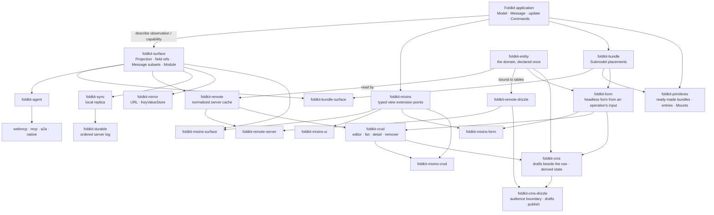

# foldkit-plus

[](https://github.com/doeixd/foldkit-plus/actions/workflows/ci.yml) [](https://deepwiki.com/doeixd/foldkit-plus)

> Packages that extend a [Foldkit](https://foldkit.dev/) application
> outward — to agents, servers, other devices, the URL, and design systems —
> without giving it a second place to keep state.

A Foldkit application is one state machine: a Schema-typed **Model**, a
**Message** union naming everything that can happen, and one pure **`update`**
function that turns a Message into the next Model and some Commands. That shape
is easy to reason about, test, and replay. It gets lost the moment an app grows a
cache in a hook, a store in the URL, a tool handler that re-implements a
transition, or a sync layer with its own reducer.

Everything in this repository keeps the one state machine. An agent can only
send Messages `update` already handles. Server data lives in the Model and is
reconciled by `update`. Replicas replay the same Messages through the same
`update`. The URL and local storage mirror a slice of the Model; they never own
one. Views are styled from outside without forking. Each package answers one
question, and they compose because they meet at explicit application boundaries.

## Choose who owns the state

| What you are adding | Authoritative owner | Extension |
| --- | --- | --- |
| Local UI state or a reusable widget | Parent Model and its update/child update | Bundle, Primitives |
| Facts loaded from a server | Server; the client cache is disposable | Remote |
| Offline edits that must converge | Client-authored operations in an authoritative journal order | Sync + Durable |
| A URL or remembered preference | Local Model; the external value is a representation | Mirror |
| Agent access or a customizable view | Existing state and transitions | Agent, Surface, Mixins |

A Surface can observe several owners. Observing a field does not grant a second
package permission to change it outside its owning transition.

```text
intent → Message → update → Model → Projection / Surface → consumer
                      |
                      └→ Command → result Message → update
```

## Sixty seconds of code

Start with one mechanism: an inspectable boundary around an existing Model.
Install `foldkit-surface` alongside the workspace-compatible `foldkit` and
`effect` versions listed under [Install](#install).

```ts
import { Schema } from 'effect'
import { defineMessageUnion } from 'foldkit/message'
import { modifyFields } from 'foldkit/struct'
import { Surface } from 'foldkit-surface'

const Model = Schema.Struct({ count: Schema.Number, internalNote: Schema.String })
const Message = defineMessageUnion({ Incremented: {} })
const initial: typeof Model.Type = { count: 0, internalNote: 'Only the app reads this' }
const update = (model: typeof Model.Type, _message: typeof Message.Type) => ({
  model: modifyFields(model, { count: count => count + 1 }),
})
const App = Surface.application({ Model, Message, initial, update })

const Counter = App.surface('Counter', {
  model: ({ model }) => ({ count: model.count }),
  messages: [Message.Incremented],
})

Surface.read(Counter, initial) // { count: 0 }
const next = update(initial, Message.Incremented()).model
Surface.read(Counter, next) // { count: 1 }
```

`Surface.application` records the schemas and, here, the existing initial value
and reducer. `App.surface` describes what the counter reads and which Message
its consumers may emit. `Surface.read` is a pure projection: it returns `count`
and leaves `internalNote` out. It performs no I/O and dispatches nothing.

The state changes only when `update` handles `Incremented`. This example calls
the reducer directly to expose that loop; a mounted Foldkit application routes
view events and Command results through it. No browser runtime is needed to
try these reads.

That same boundary can later become an agent's context, a view's input, or a
part of an ownership manifest. Add the package that interprets the boundary
when you need that behavior; a Surface alone does not fetch, replicate, or
register tools.

The example is typechecked in
[the root README fixture](./examples/todo-app/test/root-readme.test-d.ts).
For a full composition of agents, replication, mirrors, and views, follow
[the todo app](./examples/todo-app/README.md); for server-owned entities, follow
[the Remote example](./examples/remote/README.md).

## Which package do I need?

If a term below is new, the [glossary](./docs/glossary.md) defines each one
in a line.

| You want to… | Reach for | Read |
| --- | --- | --- |
| Let an LLM or another agent use the app, safely, over MCP, WebMCP, A2A, or Agent Native | `foldkit-agent` + one adapter | [Agents](./docs/agents.md) |
| Cache server entities once, know what is missing, mutate optimistically, get live updates | `foldkit-remote` (+ `-server`, `-drizzle` on the server) | [Server-derived state](./docs/remote.md) |
| Work offline, on several devices, or with other people, and converge | `foldkit-sync` on the client, `foldkit-durable` on the server | [Replicated state](./docs/replication.md) |
| Keep the filter and page in the URL, remember a draft or a preference | `foldkit-mirror` | [Mirrored state](./docs/mirror.md) |
| Package a Submodel once and place it several times, or once per key, with every part wired | `foldkit-bundle` (+ `-surface` for Module ownership) | [package README](./packages/bundle) |
| Reach for everyday browser primitives instead of hand-wiring them: media queries, timers, sockets, device state, observers, clipboard | `foldkit-primitives` | [package README](./packages/primitives) |
| Restyle or add behaviour to views, including `@foldkit/ui`, without copying markup | `foldkit-mixins` (+ `-surface`, `-ui`) | [View composition](./docs/mixins.md) |
| Use a React component in a Foldkit view, or embed a Foldkit program in a React app | `foldkit-react` | [package README](./packages/react) |
| Compile Foldkit views to React TSX source | `foldkit-react-codegen` | [package README](./packages/react-codegen) |
| Say what a feature observes and may cause, and check that nothing owns a field twice | `foldkit-surface` | [package README](./packages/surface) |
| Declare a domain once (fields, relations, selections) for the client cache, the database binding, and forms to share | `foldkit-entity` | [One domain declaration](./docs/entity.md) |
| Build a form from the input an operation accepts, with validation and a decoded value handed to the parent | `foldkit-form` (+ `foldkit-mixins-form` to draw it) | [package README](./packages/form) |
| Join a form, a Remote mutation or query, and their Entity into an edit screen or a list | `foldkit-crud` (+ `foldkit-mixins-crud` to draw lists and details) | [package README](./packages/crud) |
| Give content drafts, revisions, a schedule, and a published/unpublished boundary, without a status column | `foldkit-cms` + `foldkit-cms-drizzle` (the editor's state and the server) | [package README](./packages/cms) |

`foldkit-surface` is the shared semantic seam for Agent, Remote, Sync, Mirror,
and the Surface/Mixins bridge. It is not a mandatory base class for the whole
repository: `foldkit-durable`, core `foldkit-mixins`, and the protocol/UI
adapters can stand on their own and meet Surface-backed packages at explicit
boundaries.

## How they fit together



The arrows are integration boundaries, not new application state machines.
Agent projects application capabilities. Remote reconciles server facts into the
Model. Sync replays application Messages against an authoritative server order.
Mirror keeps a secondary representation of Model fields. Mixins extends view
structure without touching Model state. Primitives packages reusable
browser and clock behaviour without hiding state. Entity declares a domain once
as plain values; Remote, the Drizzle binding, and Form read it, and Crud joins a
form to a Remote operation. Form and Crud own their submodel transitions inside the parent Model;
Entity describes structure without holding runtime state. Durable can also be used independently
as an ordered server journal.

The rule that makes the whole graph composable is **one owner per datum**:

| State | Owner | Package |
| --- | --- | --- |
| The route, the selection, a transient error | the local Model, plain `update` | — |
| A reusable child machine's slice, placed once or per key | the parent Model | `foldkit-bundle` places |
| A media query, timer reading, socket state, device list, or clipboard result | the parent Model | `foldkit-primitives` places |
| A filter the URL shows, a draft a device remembers | the local Model | `foldkit-mirror` observes |
| Facts owned by another system | the server | `foldkit-remote` caches |
| Client-authored state that must survive offline and converge | the durable log | `foldkit-sync` + `foldkit-durable` |
| What an agent may see and do | the application | `foldkit-agent` observes and exposes |

That ownership rule is more important than the package boundaries. A single
Surface may read across local state, Remote state, and Submodels because a Surface
is an observation/capability boundary, not a second owner.

## Try it

Start with [`examples/todo-app`](./examples/todo-app). It is the browser version
of the architecture above: local-first state, owner-only rules, WebMCP tools, a
linkable filter, and view composition around one Foldkit application.

For the broadest integration trace, use
[`examples/kitchen-sink`](./examples/kitchen-sink). For one concept at a time:

| Example | Shows |
| --- | --- |
| [`examples/todo`](./examples/todo) | Agent contracts and WebMCP |
| [`examples/sync`](./examples/sync) | durable Messages, replicas, and server ordering |
| [`examples/remote`](./examples/remote) | normalized server-owned state end to end |
| [`examples/mixins`](./examples/mixins) | typed view extension points end to end |

The application examples print transcripts with important lines pinned by tests.
`pnpm demo` runs the root integration sequence; run the CMS demo separately. The [examples index](./examples/README.md) gives the recommended
reading order.

## Install

Install the pieces for the boundary you are adding; the packages are designed to
be adopted independently.

```bash
# typed application boundaries
pnpm add foldkit-surface

# agent capabilities + one protocol adapter
pnpm add foldkit-agent foldkit-agent-webmcp

# normalized server-owned state
pnpm add foldkit-surface foldkit-remote
pnpm add foldkit-remote-server foldkit-remote-drizzle # optional server compilation

# local-first replicated state
pnpm add foldkit-surface foldkit-sync foldkit-durable

# URL / local key-value representations
pnpm add foldkit-mirror

# reusable Submodels placed with every part wired
pnpm add foldkit-bundle foldkit-bundle-surface foldkit-surface

# a domain declared once, forms from an operation's input, and edit screens
pnpm add foldkit-entity foldkit-form foldkit-mixins-form
pnpm add foldkit-crud foldkit-remote # an editor, list, detail, and remover over Remote
pnpm add foldkit-mixins-crud # draws a list as a table and a detail as a description list
pnpm add foldkit-cms # content types, drafts beside the row, and a derived lifecycle
pnpm add foldkit-cms-drizzle # its server: the audience boundary, drafts, and a publish that is whole

# ready-made primitives: media, timers, sockets, observers, clipboard
pnpm add foldkit-primitives

# view extension points
pnpm add foldkit-mixins foldkit-mixins-surface

# React interop in either direction
pnpm add foldkit-react react react-dom
pnpm add -D foldkit-react-codegen # views to TSX source
```

Other agent adapters are `foldkit-agent-mcp`, `foldkit-agent-a2a`, and
`foldkit-agent-native`; `foldkit-mixins-ui` adapts compatible `@foldkit/ui`
components.

`foldkit` and `effect` are peer dependencies. Foldkit `0.158.2` peer-depends on
`effect@4.0.0-rc.112`, so these packages target Effect 4. `foldkit-durable`
requires Node 22 for `node:sqlite`. The [release matrix](./docs/releases.md)
lists every package's current version.

### Agent skill

[`skills/foldkit-plus`](./skills/foldkit-plus/SKILL.md) is an
[Agent Skill](https://agentskills.io) that teaches a coding agent what each
package owns, when to reach for it, and a basic example of each. Install it into
Claude Code, Cursor, OpenCode, and other agents with
[skills.sh](https://skills.sh):

```bash
npx skills add doeixd/foldkit-plus --skill foldkit-plus
```

## Go deeper

The root README is the map. The guides teach the architecture and each package
README documents its API.

| Topic | Guide |
| --- | --- |
| Agent contracts and adapters | [Agents](./docs/agents.md) |
| Server-owned normalized state | [Server-derived state](./docs/remote.md) |
| One domain for the cache, the database, forms, and edit screens | [One domain declaration](./docs/entity.md) |
| Local-first replication and the durable server log | [Replicated state](./docs/replication.md) |
| URL and key-value mirrors | [Mirrored state](./docs/mirror.md) |
| Inside-out view composition | [View composition](./docs/mixins.md) |
| Running a Foldkit app over a replica | [Runtime binding](./docs/sync-runtime-binding.md) |
| Design lineage and prior art | [Prior art and design lineage](./docs/prior-art.md) |

The [0.7 release post](./docs/blog/0.7.0.md) introduces Entity, Form, and Crud.
The [documentation map](./docs/README.md) gives the full reading order, package
references, design notes, and historical material. The
[release matrix](./docs/releases.md) tracks published versions; the
[revision plan](./docs/design/REVISION_PLAN.md) records ongoing design work.

## Status

Foldkit Plus is `0.x`, built against a `0.x` Foldkit and an Effect 4 release
candidate. APIs are still settling and minor releases may break. The
[CHANGELOG](./CHANGELOG.md) records what changed and why.

The repository is exercised as a system: package tests run in CI, README-facing
examples are type-checked or pinned as deterministic transcripts, and `pnpm demo`
runs the worked examples together.

## Contributing and releasing

```bash
pnpm install
pnpm format:check
pnpm typecheck
pnpm test
pnpm demo
```

See [CONTRIBUTING.md](./CONTRIBUTING.md) for the full development workflow and
[AGENTS.md](./AGENTS.md) for repository working agreements and documentation
standards. Release mechanics and the package/version matrix live in
[docs/releases.md](./docs/releases.md).

## License

MIT. These are community packages, published unscoped as Foldkit itself is. They
are not affiliated with or endorsed by the Foldkit maintainers, and the names are
theirs for the asking.

## References

- Foldkit — <https://foldkit.dev/> · <https://github.com/foldkit/foldkit>
- WebMCP — <https://github.com/webmachinelearning/webmcp>
- Agent Native — <https://github.com/BuilderIO/agent-native>