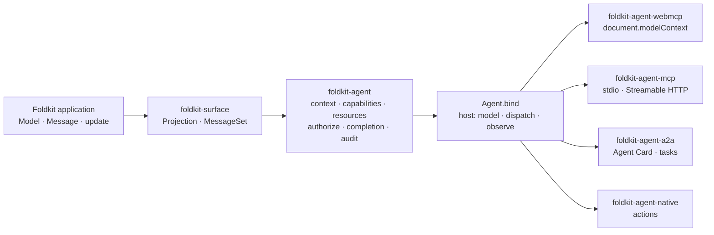

# Agents: `foldkit-agent` and its adapters

A Foldkit application already has the two things an agent needs: a **Model** it
could look at and a **Message** union it could send. `foldkit-agent` turns a
deliberate subset of each into a contract, and four adapters serve that one
contract over WebMCP, MCP, A2A, and Agent Native. Nothing in the agent path
reimplements behaviour: every capability is a Message that `update` already
handles.

- [`foldkit-agent`](../packages/agent) — the protocol-neutral contract: context,
  capabilities, resources, authorization, completion, audit.
- [`foldkit-agent-webmcp`](../packages/agent-webmcp) — the browser adapter, into
  `document.modelContext`.
- [`foldkit-agent-mcp`](../packages/agent-mcp) — MCP over stdio or Streamable
  HTTP, plus a transport-free handler.
- [`foldkit-agent-a2a`](../packages/agent-a2a) — an Agent Card and
  `message/send` as tasks.
- [`foldkit-agent-native`](../packages/agent-native) — Agent Native actions whose
  `run` only dispatches.

## The problem

Wiring an LLM to an application usually starts with a tool per feature, and the
usual things go wrong:

- a tool's handler re-implements a transition the UI already has, and the two
  drift;
- a tool can see the whole Model, secrets and transient errors included;
- a tool can send any Message, including the facts only a Command should mint;
- authorization lives in the transport, so each protocol checks it differently;
- "did it work?" means polling, because dispatching a Message and finishing the
  operation are different events;
- four protocols mean four schemas, four dispatchers, and four error mappings.

The fix is one contract: an information boundary (what an agent may see) and a
capability boundary (what an agent may do), both derived from the application,
and adapters that translate protocol to contract and nothing else.

## How it fits together



The contract is declared once, from a `Surface.application`:

```ts
const TodoAgent = Agent.forApplication(App).withPrincipal<Principal>()

const AppAgent = TodoAgent.make({
  name: 'assistant',
  context: Overview, // a Surface, or Projection.pick(App.fields.todos, …)
  messages: TodoAgent.expose(Message, {
    RequestedTodo: Agent.variant({
      name: 'add_todo',
      description: 'Add a todo with the given title',
      input: Schema.Struct({ title: Schema.String }),
      toMessage: ({ title }) => ({ title }),
      completion: {
        success: Message.SubmittedTodo,
        correlate: (request, result) => request.title.trim() === result.title,
      },
    }),
    ToggledTodo: { name: 'toggle_todo', description: 'Mark a todo done, or undo that' },
    ClearedCompleted: {
      name: 'clear_completed',
      description: 'Delete every completed todo (owner only)',
      authorize: ({ principal }) => isOwner(principal),
    },
  }),
  resources: [Agent.resource('counts', { description: '…', schema: Counts, read: counts })],
})
```

Then bound to a running application, and served:

```ts
const agentRuntime = TodoAgent.bind({
  definition: AppAgent,
  host: {
    model: mounted.model,
    dispatch: message => { mounted.dispatch(message) },
    observe: mounted.observe, // a completion contract needs to see Messages
    principal: () => principal,
  },
})

AgentWebMcp.register({ agent: agentRuntime }) // in the page
AgentMcp.stdio({ agent: agentRuntime }) // or AgentMcp.handler, AgentMcp.httpApp
AgentA2a.handler({ agent: agentRuntime })
registerPackageActions(AgentNative.actions({ definition: AppAgent, resolveRuntime }))
```

`Sync.mount` returns a host of the right shape (`model`, `dispatch`, `subscribe`,
`observe`), so a local-first application is agent-ready without a second seam;
[`examples/todo`](../examples/todo) shows the host written by hand.

## What an agent may see

`context` is a `foldkit-surface` projection: a feature Surface the view already
renders, or `Projection.pick(App.fields.…)`. The agent sees exactly that value,
so the same projection can be rendered, replicated, and shown to an agent, and
a field left out of the projection (a token, a transient error, the whole
Model) is not reachable. `Agent.resource` adds named, schema-typed reads for
data the context does not carry.

## What an agent may do

Exposure is opt-in: `expose` names the variants an agent may send, and there is
no `exposeAll`. Two rules keep the contract honest:

- **Expose intents, not facts.** A fact carries its own nondeterminism (an id, a
  timestamp) and is minted by a Command. The agent sends `RequestedTodo`; the
  application's Command emits `SubmittedTodo`. A `completion` contract then
  says the call is done when the correlated fact is applied, so `dispatch`
  resolves with the fact rather than with "the Message was received".
- **Availability precedes authorization.** `available(model)` says whether the
  capability exists in this Model; an unavailable capability is absent from the
  tool list and refused by name, before `authorize` runs, so a caller cannot
  learn whether they would have been permitted. Dispatch is a fixed order:
  resolve, `available`, decode input, `authorize`, construct, dispatch.

An invocation reads one Model snapshot for all of `available`, `authorize`, and
`toMessage`, so a capability that reads the selection twice cannot see two
different selections.

## Policy, once

`authorize` on a capability takes the principal, the decoded input, the Model
snapshot, and the transport. In the todo app the two owner-only rules are the
same rule the sync contract enforces inside the journal's append transaction:
the agent is refused early, with a typed error; the server would refuse late.
Declaring policy next to the Messages it governs is what lets both boundaries
share it.

Every decision can be recorded. `Agent.auditLog` keeps a bounded ring of
entries, refusals included, and never keeps the Model; input and principal are
opt-in and redactable. A sink that throws never fails a dispatch.

## Adapters translate and nothing else

Each adapter maps protocol vocabulary onto the runtime and stops:

| Adapter | Capability becomes | Dispatch path |
| --- | --- | --- |
| WebMCP | a tool in `document.modelContext`, re-registered as availability changes | `execute` → `dispatchUnknown` in the same page |
| MCP | `tools/list` entry with the derived JSON Schema | `tools/call` over stdio or Streamable HTTP |
| A2A | a skill on the Agent Card | `message/send` as a task; `tasks/get`, `tasks/cancel` |
| Agent Native | an action (`http: POST`, `requiresAuth`, not read-only) | `run` resolves a bound runtime per caller and dispatches |

No adapter repeats a schema, a handler, or an authorization check. The tagged
errors (`AgentCapabilityUnavailableError`, `AgentInvalidInputError`,
`AgentAuthorizationError`, `AgentCancelledError`, …) are `Schema`-backed, so an
adapter encodes one across its protocol boundary rather than inventing its own.

## The contract is data

`Agent.messages`, `Agent.schema`, and `Agent.contextSchema` expose the contract
for tests that need no LLM. `Agent.toManifest` writes `agent.json` and
`Agent.toMarkdown` writes its documentation, both reproducible for a given
contract, so a change in what the application exposes shows up in review. The
contract also carries a `Module` contract (what it observes, which Message tags
it exposes), so `Module.validate` reports an agent exposing a Message the
application does not declare, or a contract from another application.

## When not to use this

- **The agent should drive the UI.** This is not DOM automation; it dispatches
  Messages. If the behaviour is not a Message, add one.
- **The agent needs the whole Model.** That is a sign the context is wrong, not
  a reason to widen it; project what the feature would render.
- **Exactly-once effects.** Completion says a correlated fact was applied. It
  does not undo a Message after a timeout or cancellation, and it does not make
  an external action idempotent; see the durable
  [effect recovery](../packages/durable/README.md#effect-recovery) policy.

## See it working

- [`examples/todo`](../examples/todo) — the contract, a hand-written host, and
  WebMCP, as an asserted transcript.
- [`examples/todo-app`](../examples/todo-app) — the same idea over `Sync.mount`:
  the agent's context is a Surface the view renders, and its policy is the sync
  contract's.
- [`examples/sync`](../examples/sync) — an agent bound to a shared replica, so a
  server-side agent acts on the state the user sees.

The package READMEs document the full APIs, and
[`docs/design/agent-DESIGN.md`](./design/agent-DESIGN.md) records the design
rationale.
