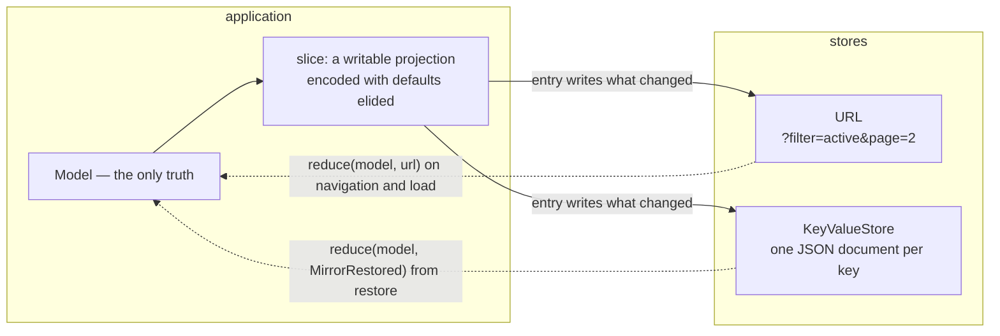

# Mirrored state: `foldkit-mirror`

Some local state should outlive the page or be linkable: the filter and page a
list shows, the search text, a collapsed sidebar, a half-written draft. Two
stores fit: the **URL** for what a link should carry, and a **key-value store**
for what a device should remember. `foldkit-mirror` keeps a slice of the Model
in step with either. The Model stays the only truth; the store is a mirror.

- [`foldkit-mirror`](../packages/mirror) — `Mirror.url`, `Mirror.kv`, and the
  `Mirror.make` kernel over any `MirrorStore`.

## The problem

Query-string state usually starts with a hook that owns a parameter, and the
usual things go wrong:

- the URL becomes a second store, so the Model and the address bar disagree;
- every parameter re-implements a codec, a default, and a history policy;
- back and forward loop through a change handler that writes what it just read;
- a preference lives in `localStorage` reads scattered through views;
- two tabs, or an old link, restore a value over an edit the user just made.

The fix is to keep the Model authoritative and derive the mirror: one writable
projection names the slice, the store is written when the slice changes, and
navigation or a cold load reduces the store back into the Model through
`update`.

## How it fits together



Declared from the application:

```ts
const Filters = Mirror.url(App, {
  fields: [App.fields.filter, App.fields.page, App.fields.q],
  keys: { q: { history: 'replace' } },
})
const Prefs = Mirror.kv(App, { key: 'todo/prefs', scope: userId, fields: [App.fields.sidebar, App.fields.draft] })
```

Wired into `update`, the URL hook the runtime already has, and one
Subscription entry per mirror:

```ts
const update = (model, message) => {
  if (Mirror.reduces(message)) return { model: Prefs.reduce(model, message) }
  if (message._tag === 'UrlChanged') return { model: Filters.reduce(model, message.url) }
  …
}
const subscriptions = Subscription.make<Model, Message, KeyValueStore>()(() => ({
  ...Filters.subscriptions,
  ...Prefs.subscriptions,
}))
```

Under `Sync.mount`, the `url` option is where a URL mirror plugs in
(`init: (model, url) => Filters.reduce(model, url)`, `onUrlChange`), and
`subscriptions` and `resources` carry the entries and the store layer.

## What the Model being the truth gives

- **Defaults.** `App.initial` holds every field's default, so a key at its
  initial value is elided from the store. `keys: { page: { keep: true } }` keeps
  one written.
- **Batching.** The entry's dependencies are the encoded keys, so one Model
  change is at most one write, and a change that encodes to the same keys is
  none. Back and forward cannot loop: `popstate` reduces into the Model, the
  entry sees the same keys, and stops.
- **Codecs.** A key's codec is derived from the field's encoded initial value
  (string, number, boolean; JSON otherwise), and `keys: { tags: { codec } }`
  supplies a readable one.
- **Links.** `Filters.href(model, { page: 2 })` is the current URL with the
  mirrored keys applied, so a link is computed from the Model, not assembled.

## Reading back

A URL mirror's `reduce(model, url)` sets the whole slice: a missing key is the
initial value, and a key that fails to decode is too, so `?page=abc` shows page
one instead of breaking the page. A store mirror's `reduce(model, message)`
takes the `MirrorRestored` its `restore` Command yields and sets only the fields
still at their initial value, so an edit made before the store answered is kept.
On a cold load the URL wins where it names a key, then the store, then the
initial value.

## One owner per datum

A mirror is not an owner. It observes fields and owns nothing, which is what
separates it from the two packages that do own state:

| State | Owner | Store |
| --- | --- | --- |
| Filter, sort, page, search text, an open panel | the local Model | the URL, via `Mirror.url` |
| Preferences, a draft, a collapsed sidebar | the local Model | `KeyValueStore`, via `Mirror.kv` |
| Client-authored state that must converge across devices | `foldkit-sync` | a durable ordered log |
| A cache of another owner's facts | `foldkit-remote` | the server |

`mirror.contract` is of kind `mirror`, so `Module.manifest` shows a mirrored
field as `local` with the mirror beside it, and `Module.validate` reports a
key-value mirror whose `MirrorRestored` the union does not declare. A URL key
belongs to one mirror per application.

## Recovery

A mirror holds no unsent user edits, so its policy is Remote's, not Sync's: a
key-value document of another version or scope, or a malformed one, is removed
rather than restored; a store failure is absorbed and never fails the
application; a slice back at its defaults removes the document. Outside a
browser the URL store writes nothing, so a server render is safe.

## When not to use a mirror

- **Two tabs must agree.** A mirror is last-write-wins with no log; use
  [`foldkit-sync`](./replication.md).
- **The value is a server fact.** Use [`foldkit-remote`](./remote.md); the URL
  should carry the identity (`?projectId=p1`), not the entity.
- **The key is a route.** A Foldkit router owns the path; a mirror touches only
  its own query keys and composes with `route.query(schema)` when they differ.

## See it working

[`examples/todo-app`](../examples/todo-app) keeps the filter in the URL
(`/?filter=active`, linkable and read back on navigation) and the composer's
draft in Web Storage; `pnpm demo` prints both in section 12 of the transcript,
and `test/runtime.test.ts` round-trips the URL. The design note is
[`docs/design/MIRROR.md`](./design/MIRROR.md), and the
[package README](../packages/mirror) documents the API.
