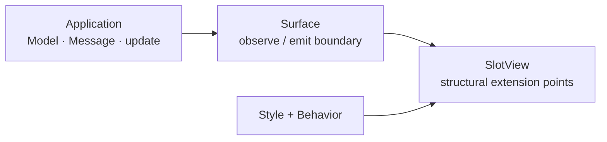

# Inside-out view composition: `foldkit-mixins`

`foldkit-mixins` gives Foldkit views **typed extension points**.

A component author decides which structural points may be customized — `root`, `input`, `label`,
`trigger`, and so on. The caller can later attach appearance and element-level behavior to those
points without copying the component's markup or asking the component author to add another prop.

That is what "inside-out" means here: customization is authored **outside** the component, but it
attaches to extension points deliberately published **from inside** the component.

## The problem it solves

A reusable component often starts simple and accumulates customization requests over time:

```text
Button
├─ className
├─ iconClassName
├─ compact
├─ destructive
├─ showTooltip
├─ trackClick
├─ ariaLabelOverride
├─ onFocusDecoration
└─ ...
```

None of those props is individually unreasonable. The problem is that the component becomes the
meeting point for every design-system, accessibility and product-specific concern that might ever
want to decorate it.

The other common answer is to copy the render body at the call site and edit it. That keeps the
component API small by giving up reuse.

Mixins offer a third option:

```text
Button
├─ root slot
├─ icon slot
└─ label slot

caller
├─ BrandStyle       → root, icon
├─ TooltipBehavior  → root
└─ Analytics        → root
```

The component publishes the supported extension points once. Independent callers compose around
that contract.

## The five-term mental model

You can understand the package with five terms:

| Term | Meaning |
| --- | --- |
| **Slot** | One named extension point in a view. |
| **Slots** | The public contract describing all extension points and what each permits. |
| **Style** | Appearance attached from outside: classes, inline declarations and CSS rules. |
| **Behavior** | Element-level interaction attached from outside: attributes and an optional Foldkit `Mount`. Never application state. |
| **SlotView** | The pure Foldkit view that renders those slots. |

Style and Behavior compile to one internal `Mixin` representation. A resolver combines the
contributions and enforces ownership rules before ordinary Foldkit attributes reach the renderer.

```mermaid
flowchart TB
  component["component / SlotView"]
  slots["Slots contract<br/>where customization is allowed"]
  style["Style<br/>how it looks"]
  behavior["Behavior<br/>how the element reacts"]
  resolver["Resolver<br/>merge + ownership checks"]
  attrs["ordinary Foldkit attributes"]

  component --> slots
  slots --> style
  slots --> behavior
  style --> resolver
  behavior --> resolver
  resolver --> attrs
```

## Why this is more than `className`

A `className` escape hatch says only "put this class on something." It does not say what that
something structurally is, which events it exposes, which attributes callers may add, or which
pieces are too important to replace.

A slot can express all of those things:

```text
input slot
├─ capability: TextInput
├─ events: input
├─ attributes: aria-invalid
├─ protected: role
└─ hidden: false
```

That means a Behavior can say "I require a text input that exposes `aria-invalid`" and fail at
definition time if somebody tries to attach it to an incompatible slot.

The contract also gives tooling something richer than DOM markup to inspect: a serializable list
of supported customization points, capabilities, events and attributes.

## Style and Behavior are deliberately different

The package separates two concerns that ordinary component props often mix together.

**Style** is appearance as data. It can carry classes, inline declarations, recipes, themes,
pseudo selectors, media queries and other deterministic CSS rules.

**Behavior** is reusable element-level interaction. Useful examples include:

```text
tooltip wiring
analytics click tracking
ARIA decoration
keyboard behavior
focus management
ResizeObserver
intersection observer
```

A Behavior may contribute attributes and a `Mount`, but it does not own application state.

That boundary is important. If a behavior needs a widget's selected value, open state, request
state or domain data to become its private mutable state, the right abstraction is still Foldkit:
Model/Submodel + Message + `update` + Commands. Mixins should not become React hooks in Foldkit
clothing.

## A small example

The component author publishes slots:

```ts
const FieldSlots = Slots.define({
  root: Slot.make({ capability: Capability.Container }),
  input: Slot.make({
    capability: Capability.TextInput,
    events: [Event.Input],
    attributes: [Attr.AriaInvalid],
  }),
})
```

A design system can style those points without editing the view:

```ts
const FieldStyle = Style.forSlots(FieldSlots)({
  root: Style.class('field'),
  input: Style.class('field-input'),
})
```

A feature can independently attach behavior:

```ts
const Validation = Behavior.forSlots(FieldSlots)<FieldInput, Message>({
  input: Behavior.slot({
    requires: { capability: Capability.TextInput, attributes: [Attr.AriaInvalid] },
    attributes: ({ input, h }) => [h.AriaInvalid(input.invalid)],
  }),
})
```

And the view resolves both through the same published points:

```ts
const Field = SlotView.forMessages<Message>()
  .define(FieldSlots, (input: FieldInput, slots, h) =>
    h.label(slots.root.attrs(), [
      h.input(
        slots.input.attrs([
          h.Value(input.value),
          h.OnInput(value => Message.ChangedValue({ value })),
        ]),
      ),
    ]),
  )
  .pipe(Style.attach(FieldStyle), Behavior.attach(Validation))
```

The important part is not the amount of code. It is where responsibility lives:

```text
component author  → publishes stable extension points
style author      → owns appearance
feature author    → owns element-level behavior
Foldkit app       → still owns state and transitions
resolver          → owns merge/conflict policy
```

## Conflict rules are part of the abstraction

Attachments are not concatenated and left to incidental renderer ordering. The resolver has one
merge policy:

- classes are additive and deduplicated;
- inline styles merge per property;
- an event or scalar attribute has one owner;
- a second owner produces a stable diagnostic instead of silently winning;
- `ChildAttribute` values are preserved by identity;
- `Key` and `InnerHTML` are structural and cannot be overridden;
- multiple mounts compose into one `OnMount`.

This is what lets a design system and a feature attach independently without each one needing to
know what the other did.

## Slots are contracts, not DOM nodes

A slot is metadata about an extension point. It may declare:

- a **Capability** such as `Container`, `Interactive` or `TextInput`;
- published **Event** and **Attr** tokens;
- platform **Requirement** tokens such as Keyboard, Pointer or Clipboard;
- `hidden` points that are internal to the component;
- `protected` events, attributes or style properties that attachments may not replace.

Capability is hierarchical, so a Behavior requiring `Interactive` can attach to a `TextInput`.
Custom capabilities, events and attributes can be created with their corresponding `.make`
constructors.

## Surface and Mixins answer different questions

`foldkit-surface` and `foldkit-mixins` compose well because they govern different boundaries:

```text
Surface
  What data may this feature observe?
  Which Messages may it emit?

Slots
  Which structural points may callers customize?
  What may they attach there?
```

`foldkit-mixins-surface` connects the two. The `SlotView` receives the Surface projection rather
than the root Model, and its builder carries the Surface's Message subset.



This is why Surface integration should be thought of as an additional boundary, not as something
you must understand before using mixins.

## `@foldkit/ui`

`@foldkit/ui` components already expose a useful consumer seam when they hand typed attribute
bundles to `toView`. `foldkit-mixins-ui` turns those bundles into named slots so the same Style and
Behavior model can apply.

Button, Input, Checkbox, Disclosure, Dialog, Popover, Tooltip, Slider, Tabs, RadioGroup, Calendar
and more are adapted.

There are two reasons a component may not be covered:

1. `Menu`, `Listbox`, `ComboBox` and `DatePicker` build their full element tree internally and
   expose no `toView`/attribute bundle seam. There is nowhere for a mixin to attach without a
   component API change.
2. `Toast`, `FileDrop`, `VirtualList`, `DragAndDrop`, `Anchor`, `HoverIntent` and `Animation` simply
   do not have adapters yet. `FileDrop`, for example, exposes the seam an adapter would need.

That distinction matters: one is an architectural boundary, the other is unfinished coverage.

## Accessibility contracts

`A11y.pattern` describes structural accessibility expectations in the same vocabulary as Slots:

```ts
const DialogPattern = A11y.pattern({
  trigger: { capability: Capability.Interactive, events: [Event.Click] },
  content: { capability: Capability.Container },
})

A11y.validate(DialogPattern, DialogSlots)
```

Validation is pure and DOM-independent. It checks the declared contract for missing or hidden
slots, incompatible capabilities, and unpublished events or attributes. It does not inspect the
rendered DOM and does not claim WCAG certification.

## Style as data

Rule-based Style compiles deterministic rule text to deterministic class names. Equal rules share
a class; server and client derive the same output without a render-time collector.

That gives the application explicit CSS data:

```text
Style.pseudo / media / supports / container / nest
                    ↓
          deterministic class
          + deterministic CSS
```

`Style.stylesheet(...)` combines and deduplicates those rules. Input-dependent rule generation is
intentionally restricted: `Style.whenInput` may choose static pieces, but it cannot create a new
rule graph for every render.

## Introspection and tooling

Because Slots and Mixins are data, the package can describe them without rendering a DOM tree.
That is useful for tests, DevTools, generated documentation and agent tooling.

`Slots.describe`, `Slot.describe` and the Surface bridge expose serializable metadata, while
resolver failures use stable diagnostic codes and structured details.

## See the trace

Use the examples in increasing order of scope:

- [`examples/mixins`](../examples/mixins) — the focused trace: Surface → SlotView → Style → Behavior.
- [`examples/todo-app`](../examples/todo-app) — a whole application using recipes, input-driven style, Theme, Behaviors and `@foldkit/ui` adapters.
- [`examples/remote`](../examples/remote) — the same view boundary over server-derived state.

`pnpm demo` runs all three.

## Limits

- Mixins can only attach where a view deliberately publishes a slot. That is the point: the
  extension surface is explicit rather than universal.
- Behavior does not own state. Reach for Model/Submodel when state is required.
- Rule-based Style produces CSS data; the application is responsible for including the resulting
  stylesheet.
- A component that exposes no render/attribute seam cannot be adapted externally.
- `A11y.validate` checks contracts, not rendered DOM or WCAG compliance.

## Package map

- [`foldkit-mixins`](../packages/mixins) — Slots, resolver, Style, Behavior, Theme and A11y.
- [`foldkit-mixins-ui`](../packages/mixins-ui) — `@foldkit/ui` adapters.
- [`foldkit-mixins-surface`](../packages/mixins-surface) — Surface → SlotView bridge.
- [`docs/design/mixins-DESIGN.md`](./design/mixins-DESIGN.md) — substrate probes and implementation decisions.
