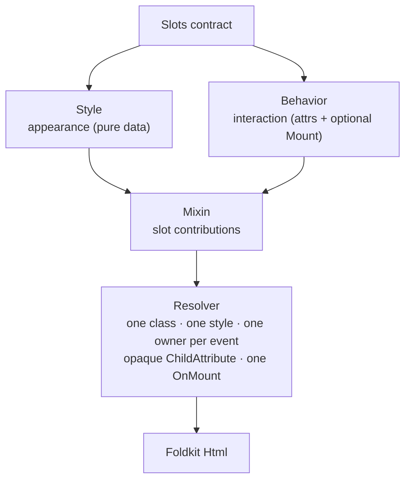

# Inside-out view composition: `foldkit-mixins`

A Foldkit view is a pure function of the Model. Most of the time that is all you
need. Two things get awkward as a view grows:

- **You want to style or restyle it** without copying its markup, and the style
  lives in a design system the component author never saw.
- **You want to add interaction** — a tooltip, an observer, an extra handler —
  without the component growing an options object for every caller.

`foldkit-mixins` answers both with one idea: a view publishes the **structural
points it is willing to customize**, and independent Style and Behavior values
attach to those points from outside.

There is no second runtime. State is a Foldkit Model/Submodel, a transition is
`update`, fetching is a Command, an element-owned effect is a `Mount`, and every
attribute a mixin builds belongs to the view's own Message universe.

- [`foldkit-mixins`](../packages/mixins) — slot contracts, the resolver, Style,
  Behavior, Theme, A11y.
- [`foldkit-mixins-ui`](../packages/mixins-ui) — `@foldkit/ui` adapters that
  publish a component's attribute bundles as slots.
- [`foldkit-mixins-surface`](../packages/mixins-surface) — binds a
  `foldkit-surface` projection and Message subset to a `SlotView`.

## The problem

`@foldkit/ui` already gets this half right: its components do not own markup. They
build typed attribute bundles and hand them to a consumer `toView` callback, so
the consumer composes the DOM. But "here is an array of attributes" is not a
contract: nothing says which attribute groups exist, what a caller may add, or
what happens when two callers add conflicting handlers.

The usual failure modes:

- restyling means copying the `toView` body into every call site;
- a wrapper component grows one boolean option per customization, and each one
  re-renders differently from the original;
- two "add an onClick" helpers silently install two handlers on one element;
- an element observer is wired with a raw `useEffect`-shaped idea that fights
  Foldkit's `Mount` lifecycle and time travel.

## How it fits together

A **`Slot`** is named metadata: a capability, the events and attributes it
exposes, and optionally protected pieces. **`Slots.define`** publishes a map of
them. **`Style`** and **`Behavior`** compile to the same `Mixin` representation, so
one resolver owns merge and conflict policy. **`SlotView.define`** is the pure
view that calls `slots.<name>.attrs(base)` while rendering.

## Those four concerns

| Layer | Owns |
| --- | --- |
| `Slots` | The public attachment points: capability, events, attributes, hidden/protected. |
| `Style` | Appearance as data: classes, inline declarations, input-driven conditions, recipes, and a deterministic rule compiler (pseudo/media/keyframes/…). |
| `Behavior` | Interaction attached to a slot: attributes built from the view's input and `h`, plus an optional Foldkit `Mount`. Never state. |
| `foldkit-mixins-surface` | The bridge to `foldkit-surface`: the renderer's input is the projection, and its builder carries the Surface's Message subset. |

## One owner per datum

Mixins change how a feature looks and reacts; they do not change who owns its
state.

| State | Owner |
| --- | --- |
| A widget's open/selected/value | a Foldkit Model/Submodel, plain `update` |
| A network call caused by a Message | `update` → Command |
| An element-scoped effect (`ResizeObserver`, focus trap) | a `Mount` |
| Appearance and interaction attached to a slot | `foldkit-mixins` |

A Behavior that "needs state" is a signal to reach for a Submodel, not for a
hidden atom. That boundary is what keeps this package from becoming React hooks
in Foldkit clothing.

## The resolver

Attachments are not concatenated and left to the renderer. They are normalized,
applied in attachment order, checked for ownership, and emitted canonically:

- classes are additive and deduplicated into one `Class`;
- inline styles merge per property, last attachment wins;
- an event or scalar attribute has one owner; a second owner is a
  `mixins:event-conflict`/`mixins:attribute-conflict`, not a silent second handler;
- a `ChildAttribute` (a Submodel's published handler) is preserved by identity;
- `Key`/`InnerHTML` are structural and cannot be overridden;
- every mount contribution composes into exactly one `OnMount`.

Conflicts throw a `DiagnosticError` with a stable code, so a definition-time
mistake fails loudly instead of producing a subtly wrong element.

## `@foldkit/ui`, and where it stops

`foldkit-mixins-ui` formalizes the attribute bundles of components that expose a
consumer seam — Button, Input, Checkbox, Disclosure, Dialog, Popover, Tooltip,
Slider, Tabs, RadioGroup, Calendar, and more — and resolves mixins around them.

It does **not** adapt every component. `Menu`, `Listbox`, `ComboBox` and
`DatePicker` build their whole element tree internally and expose no
`toView`/attribute bundles, so there is nothing to attach to. That is a boundary
of the component API, not of the mixin model.

## See the trace

- [`examples/mixins`](../examples/mixins) — Surface → SlotView, with
  `Style.whenInput`, a Style rule compiled to a class and CSS, a Behavior reading
  the projected input, and the serializable `SurfaceView.describe` metadata.
- [`examples/remote`](../examples/remote) — the same view layer over a
  `foldkit-remote` projection: plan → prefetch → render → mutate → decode failure.
- [`examples/todo-app`](../examples/todo-app) — a whole application styled this
  way: `Style.recipe`, `Style.whenInput`, a Theme, Behaviors for the row editor,
  and `@foldkit/ui` Button and Checkbox through `foldkit-mixins-ui`.

`pnpm demo` runs all three.

## Limits

- Rule-based Style compiles to deterministic classes and CSS **data**; the
  application injects the stylesheet. There is no render-time collection or
  extraction, and rules inside `Style.whenInput` are rejected.
- Mixins attach where a view publishes slots. A view that publishes none can
  still be styled the ordinary way.
- `A11y.validate` checks the declared slot contract; it is not a DOM audit and
  does not claim WCAG certification.

## See also

- [`packages/mixins/README.md`](../packages/mixins/README.md) — the API.
- [`docs/design/mixins-DESIGN.md`](./design/mixins-DESIGN.md) — substrate probes
  and implementation decisions.
