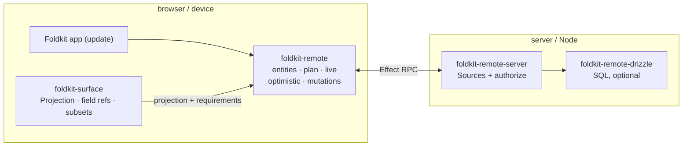
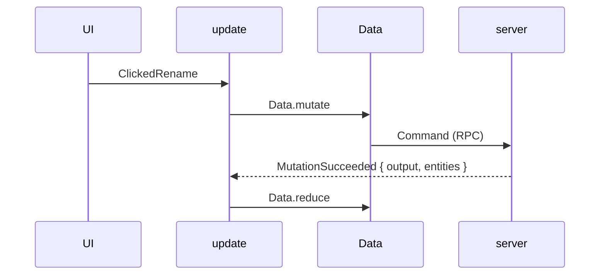

# Server-derived state: `foldkit-surface` + `foldkit-remote`

A Foldkit Model holds all application state. Some of it the client owns — the
selected tab, a draft, the current route — and some of it is a **cache of server
data**. `foldkit-remote` keeps that cache normalized and inside the Model, so
server facts move through the same `update` as everything else. `foldkit-surface`
is the projection layer underneath it.

- [`foldkit-surface`](../packages/surface) — the observation boundary: pure Model
  projections, field references, and Message subsets.
- [`foldkit-remote`](../packages/remote) — the normalized entity store, the
  requirement planner, and the Remote Submodel.
- [`foldkit-remote-server`](../packages/remote-server) — the Sources and
  authorization that answer the client.
- [`foldkit-remote-drizzle`](../packages/remote-drizzle) — compiles selections and
  queries to Drizzle's typed query graph.

Remote is not a data-fetching hook. It answers one question:

> What server-derived information does this feature require, what do we already
> know, what is missing, and how should incoming facts change the normalized
> Model?

## The problem

Server data in a Foldkit app usually starts as ad-hoc fetching, and the usual
things go wrong:

- each view fetches what it renders, so two views fetch the same entity twice;
- loading and error state is re-invented per view;
- a mutation response patches some copies and misses others;
- a retry or double-submit applies the same change twice;
- a live update and a refetch race, and last-arrival wins;
- "is this field missing, or is it legitimately `null`?" is unknowable.

The fix is a **normalized cache**: entities stored once by identity, field
presence tracked explicitly, and every producer of new facts reconciled through
one pure reducer that lives in the Model.

## How they fit together



The client half is a Foldkit Submodel. The application embeds `Remote.Model`
in its Model, spreads `Remote.messages` into its Message union, and binds the
domain with `Remote.make({ model: App.model.remote, entities, … })`. The bound
`Data` is the application API: a Surface reads through `Data.get`,
`Data.live`, and `Data.query`; `Data.subscriptions` fetches, subscribes, and
retains for the active Surfaces; `update` starts mutations with `Data.mutate`,
pages with `Data.next`/`Data.fetch`, and reduces Remote's Messages with
`Data.reduce`. Each compiles to a kernel function of the same name, documented
as the package's [Advanced](../packages/remote/README.md#advanced-the-kernel)
section.

The server half compiles Sources into the `RemoteRpc` handlers. Transport is
Effect RPC, so HTTP, WebSocket, worker, or in-process is an Effect layer choice;
Remote does not define a transport.

## What is normalized

An entity is stored once, keyed by its name and id, regardless of how many views
read it. A connection stores **references** with explicit boundaries.

```text
Project:p1            name PRESENT   status STALE   owner PRESENT → User:u7
User:u7               name PRESENT   avatarUrl MISSING
ProjectsByOwner(u7)   Project:p9  Project:p7  Project:p4  [gap]  Project:p1
```

- **Presence is separate from values.** Missing, present `undefined`, present
  `null`, stale, and not-found are distinct, and presence is never inferred from
  `value === undefined`.
- **Tombstones make absence cacheable.** A not-found entity is not refetched
  forever; a later write clears the tombstone.
- **A connection is an ordered structure with boundaries.** If page 1 is
  `A B C D` and page 3 is `I J K L`, a flat array would falsely claim they are
  adjacent. Segments with explicit boundaries make the unloaded middle an honest
  gap.

## Requirements and observation

A Surface's projection carries its remote **requirements** — entity, id, fields,
a pagination window per relation, and through `relations`, the slice required of
each relation's target — as plain data. Reading is pure; it performs no I/O. A
nested selection (`owner: UserSummary`) reads through the ref in the store and
assembles the target's fields; the store itself stays normalized.

The planner diffs requirements against the store and returns only the missing or
stale fields. A relation whose field is being fetched rides on the request, so
the server resolves the graph in one read; a relation the store already holds is
followed into concrete requirements for its targets. It is deterministic and
takes `now` as input (`PlanFreshness`)
rather than reading the clock, so the same store and requirements produce the same
plan.

Fetching is a Foldkit Subscription derived from the active Surfaces, and
activation is a fact of the Model:

```ts
Data.subscriptions({
  page: Surface.at(ProjectPage, model => ({ projectId: model.route.projectId })),
})
```

Each active Surface gives a read entry, which plans and fetches only the missing
fields through `RemoteClient` and emits a `RemoteMessage` (a fully-known Surface
emits nothing), and a live entry for what it reads through `Data.live`; one
retain entry keeps what the active Surfaces reach. SSR, route/hover prefetch,
and tests reuse the same plan through `Data.prefetch`.

A query is a Projection too. `Data.query(ProjectsByOwner, { ownerId }, {
select: ProjectSummary, first: 25 })` reads the connection as a `Page` of the
selected items, and carries the connection next to its requirements. The read
entry plans it like a field: a connection the Model does not hold (or holds
stale) is a query to run, and once its page is known, the page's items are
requirements like any other, read under `select`. `Data.next(model, projection)`
is the following page's `QueryRef` from the loaded boundary, and
`Data.fetch(ref)` the Command that merges it; the same projection then reads
every loaded page.

What a field the store already holds means is a `RemotePolicy` on `observe` and
`prefetch`: `cacheFirst` (default) fetches only what is missing,
`staleWhileRevalidate({ maxAge })` refetches an entry older than the window, and
`networkOnly` fetches every selected field. A policy compiles to planner options;
it is not a second cache. A refreshing policy emits `RefreshStarted` before the
read, which marks the refetched fields stale.

Reads through `Remote.clientLayer` coalesce: requirements issued together are one
batch, a requirement already in flight is joined, and every waiter gets the
whole result. Retention is a Message too: `Remote.retain` lists the observed
projections as roots and emits `RetentionChanged` after a grace period, and the
reducer's pure `gc` keeps what the roots reach through the store's refs plus any
pending optimistic change.

In the view, a remote field is a `RemoteData`. `Remote.select` produces
`Ready` once its selected fields are present, `Refreshing` while one is stale
(an observer is refetching it), `Failed` if the server data does not decode, and
`NotFound` for a tombstone. A value the store lacks reads as `Loading` while a
read is fetching it and `Initial` when none is: the read entry emits
`ReadStarted` before it fetches, and `ReadReceived` or `ReadFailed` clears the
mark. That distinction is the one worth rendering differently, because nothing
fetches a projection no active Surface observes; it reads `Initial` forever, and
a spinner there hides the wiring mistake rather than showing progress. There is
no hidden suspense; the states are explicit.

## Mutations and live data

A mutation flows through the ordinary Foldkit path — UI Message → `update` →
`Data.mutate` → Command — and returns to the Model as a `RemoteMessage`:



`Data.mutate` applies `MutationStarted` to the Model (the request id comes from
the Model's own sequence, so `update` stays pure) and returns the Command whose
Message settles it. The result carries the typed `Output` **and** normalized
entity patches. Settling is idempotent per `requestId`, so a transport retry
cannot apply the same change twice. `Remote.mutateInto` is the one-step
imperative form for SSR and tests.

Optimistic changes belong to the mutation: `MutationStarted` carries its entity
patches and connection changes (`ConnectionChange.prepend`/`append`/`remove`), and
success or failure releases them together by request id. Patches are ordered
**layers** over the base store, not inverse patches: the visible store is
recomputed as base + layers, so overlapping layers rebase for free. Connection
changes are overlays outside the server-known region; a result's confirmed
`connections` take the place of the request's own, so a temporary edge becomes
the real one in place.

On the server, `RemoteServer.liveHub` turns "these fields of this entity
changed" into the right patch for each subscriber: it re-reads the changed
fields a subscriber selects through the entity's own source, under that
subscriber's principal, so authorization and computed fields take the normal
path and a subscriber selecting none of the fields costs nothing.

Live data is an Effect streaming RPC. Each stream has a monotonic cursor:
duplicates are ignored, and an event **ahead** of the cursor is a gap — it is not
applied, and the stream is recorded so the host can resync rather than silently
miss facts. Entity events update the store; connection events change membership
and ordering. A deleted entity is a tombstone that every connection listing it
skips, a live removal hides a known edge until a fresh page brings it back, and
a merged page prunes the settled overlays it supersedes.

## One owner per datum

A logical piece of state should have one authoritative owner. Surface composes
the owners; it does not erase the boundary.

| State | Owner |
| --- | --- |
| Current route, selected item, transient errors | the local Model, plain `update` |
| Server-derived, disposable cache | `foldkit-remote` |
| Client-owned replicated state, offline writes, convergence | `foldkit-sync` |
| Local state the URL shows or a store remembers (a filter, a page, a draft) | the local Model, mirrored by `foldkit-mirror` |

Reaching for the wrong owner is the usual source of double-fetch bugs: a
collaborative draft belongs to Sync, an analytics summary to Remote, and the
currently selected project to the local Model. A Surface may project all three at
once.

## Persistence and recovery

A snapshot is the entity store and nothing else; runtime state stays with the
session. `RemotePersistence.dehydrate`/`hydrate` are the deterministic text
forms (SSR embeds one in the page), `RemotePersistence.save`/`restore` keep
one in Effect's `KeyValueStore`, and the `Hydrated` Message merges one into the Model by policy
(`replace` or `preserve-existing`). A snapshot names its version and `scope`
and may be bounded by `maxBytes`. The cache is server-derived and
**disposable**: a snapshot that is another version, another scope, oversized,
or malformed is removed and the planner refetches. This is the opposite of
Sync's preserve-and-recover policy, because Remote holds no unsent user edits;
there is nothing to lose.

## When not to use Remote

- **Local-only state.** Use the Model and `update`; there is no server truth to
  cache.
- **Offline writes and convergence.** Use [`foldkit-sync`](./replication.md); it
  owns client-authored operations and orders them through a durable log.
- **Request-level caching of one expensive endpoint.** Effect's `PersistedCache`
  fits (`Request → Result`); Remote is `Entity + Field → Value` and normalizes
  across requests.
- **Peer-to-peer or CRDT replication.** Out of scope.
- **A general-purpose database.** Remote holds an application-facing cache; it is
  not a query engine. `foldkit-remote-drizzle` compiles the selection and query
  it already understands into SQL, and no further.

## Worked examples and limits

- `examples/remote` is a worked `entity → select → Data → App.surface →
  prefetch → refresh → query page → render → mutate → retain` trace against an
  in-process client, and
  `examples/kitchen-sink` runs the same path over `foldkit-remote-server` and
  `foldkit-remote-drizzle` (a nested selection, the live hub, an optimistic
  insert confirmed in place, hydration, retention). Both are asserted line by
  line. The test suites remain the exhaustive executable specification:
  `pnpm exec vitest run packages/remote/test packages/remote-server/test
  packages/remote-drizzle/test`.
- The transport is Effect RPC and nothing else; a wire change is a protocol
  version bump (`REMOTE_PROTOCOL_VERSION`), and a request is bounded in fields
  per entity, relation depth, and ids per entity.
- Coalescing is per `RemoteClient` layer, and retention keeps what the active
  Surfaces reach (`Data.subscriptions`) or `Remote.retain` lists.
- The live hub subscribes the requirements' own entities, not nested relation
  targets; a change to a target reaches a subscriber through its own
  requirement or a refetch.

## See the APIs

The package READMEs document the full surface:
[`foldkit-surface`](../packages/surface),
[`foldkit-remote`](../packages/remote),
[`foldkit-remote-server`](../packages/remote-server), and
[`foldkit-remote-drizzle`](../packages/remote-drizzle). The worked trace is in
[`examples/remote`](../examples/remote). The design rationale is in
[Revision Plan §8](./design/REVISION_PLAN.md#8-remote).
