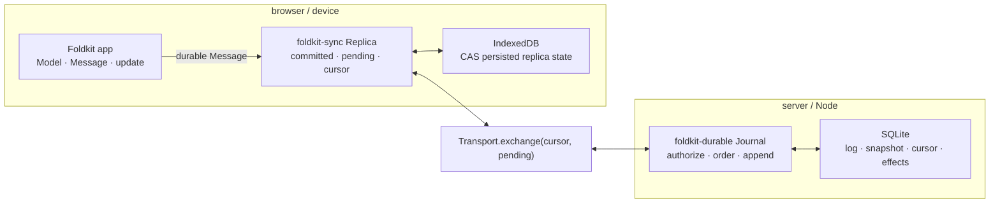

# Replicated state: `foldkit-sync` + `foldkit-durable`

Some Foldkit state should keep working when the network disappears, survive a
reload, and converge when several tabs, devices, or server-side actors edit the
same document.

Foldkit Plus solves that with two separate responsibilities:

- [`foldkit-sync`](../packages/sync) is the **client-side replica**. It owns the
  persisted outbox, optimistic shared state, reconciliation, transport, presence,
  and browser runtime binding.
- [`foldkit-durable`](../packages/durable) is the **authoritative server journal**.
  It owns committed operation identity and order, snapshot/cursor storage,
  idempotent append, compaction, authorization at commit, and durable external-
  effect outcomes on SQLite.

The important part is what neither package replaces: your application's existing
**Model**, **Message** union, and **`update`** remain the state machine. A durable
edit is an existing application Message wrapped in replication metadata, not a
second action language and not a second reducer.

> **The core model:** the server owns the committed order; each replica owns its
> still-pending local operations; the UI sees those pending operations replayed
> over the committed state.

This guide is the conceptual map for both packages. The package READMEs are the
API references once the model below is clear.

## First choose the right owner

Replication is not the answer for every value that crosses a process boundary.
The ownership distinction matters more than the package names:

| State or fact | Authority | Recovery mechanism | Package |
| --- | --- | --- | --- |
| Route, selected tab, transient error | local application Model | normal application logic | plain Foldkit |
| Server-owned data the client may discard and refetch | server | refetch | `foldkit-remote` |
| Client-authored edits that must survive offline/reload and later agree | durable operation history | replay + reconciliation | `foldkit-sync` |
| Authoritative order, snapshot, cursor, idempotent commit | server journal | journal + checkpoint | `foldkit-durable` |
| Linkable or remembered local state | application Model | restore representation | `foldkit-mirror` |

The Remote/Sync distinction is the one most worth memorizing:

```text
Remote
server owns the fact
client cache is disposable
refetch is recovery

Sync
client creates durable intent
pending operations are not disposable
replay + reconciliation is recovery
```

A Surface may observe local state, Remote state, and Sync-owned state at the same
time. Observation does not change who owns each datum.

This architecture is also deliberately **not peer-to-peer CRDT replication**.
There is one authoritative server order for a document. If every peer must
accept writes independently and merge without a server order, use a different
replication model.

## The replica mental model

Everything else in Sync follows from one equation:

```text
authoritative committed snapshot
              +
pending local operations
              =
optimistic shared state the UI sees
```

Suppose the server has committed operations `A B C`, while this device has made
local edits `D E` that have not committed yet:

```text
server order:   A  B  C
local pending:           D  E

visible state = replay(A, B, C, D, E)
```

The UI does not wait for the server. `D` and `E` are already visible because the
replica replays them over its committed snapshot.

Now another device gets `X` committed first:

```text
new server order: A  B  C  X
local pending:                D  E

new visible state = replay(A, B, C, X, D, E)
```

Nothing needs a bespoke merge callback for this case. Reconciliation changes the
committed base underneath the local edits and replays whatever is still pending
on top.

That is what **rebase** means throughout these packages.

## One durable edit, end to end

Before looking at either package API, follow one edit through the whole system:

```text
user dispatches a durable Message
            |
            v
normal application update/replay runs immediately
            |
            v
operation is persisted in the local outbox
            |
            v
UI sees committed + pending now
            |
       network later
            v
replica exchanges cursor + pending operations
            |
            v
server validates / authorizes / assigns authoritative order
            |
            v
server returns commits + acknowledgements / rejections / checkpoint
            |
            v
replica replaces or advances the committed base
            |
            v
drop operations that are now committed, acknowledged, or rejected
            |
            v
replay whatever is still pending on top
```

`foldkit-sync` owns the client half of that loop. `foldkit-durable` is one server
implementation of the authoritative half.

The transport is only the seam between them.

## Message versus operation versus committed operation

There are three layers that are easy to conflate.

### Message: application meaning

A Foldkit Message says what happened or what the application intends to do:

```text
CreatedTodo({ id, title })
RenamedTodo({ id, title })
DeletedTodo({ id })
```

Your existing `update` says what those Messages mean for the Model.

### Operation: durable client envelope

When a Message is selected as durable, Sync wraps its encoded form in protocol
metadata. Conceptually, the current operation envelope contains:

```ts
{
  documentId,
  replicaId,
  localSequence,
  opId,
  baseCursor,
  message,
}
```

It also carries protocol/schema versions on the wire and in persisted replica
state.

The stable operation id is derived from the replica and local sequence. Retrying
the operation therefore reuses its identity instead of creating a second edit.
`baseCursor` records the server position the replica knew when the operation was
created; it does not turn the client into the authority on order.

### Committed operation: server order

Once the server accepts an operation it gains an authoritative
`serverSequence` and trusted actor identity. That committed sequence is what all
replicas eventually replay.

```text
application Message
        |
        v
client Operation
identity + local metadata
        |
        v
server CommittedOperation
authoritative sequence + actor
```

Sync adds those envelopes around an existing Message. It does not replace the
Message as the application vocabulary.

## What is shared, and what stays local

Sync replicates a **writable Projection**, not the whole Model:

```text
Model
 ├── todos             -> shared / replicated
 ├── selectedTodoId    -> local only
 └── transientError    -> local only
```

A typical contract names both the state slice and the Messages allowed to change
it:

```ts
const TodoSync = Sync.forApplication(App).make({
  documentId: DocumentId.make('todos'),
  shared: Projection.pick(App.fields.todos),
  durable: MessageSet.make(App, [
    Message.CreatedTodo,
    Message.RenamedTodo,
  ]),
})
```

Read that declaration as:

```text
Projection.pick(App.fields.todos)
    = what state is replicated

MessageSet.make(...)
    = which existing transitions may become durable operations
```

`Sync.forApplication(App)` derives the shared schema, initial shared value,
replay function, operation codecs, and server journal contract from the same
application declaration. There is no sync-specific copy of `update` to keep in
agreement.

## What makes a Message durable?

A durable Message must be something another machine can replay later and obtain
the same shared state.

In practice, that means a deterministic, state-only transition of the declared
shared Projection.

Derived replay protects that boundary. It refuses a durable Message when the
application's `update`:

- returns a Command — a live external effect cannot be replayed later; or
- changes a field outside the shared Projection — that change would disappear
  when only the shared slice is installed and replayed.

For example:

```text
RequestedChargeCard
  -> runs a Command / talks to a provider
  -> local intent, NOT durable

CardCharged
  -> pure fact about shared state
  -> durable and replayable
```

The general pattern is:

```text
local intent Message
      |
      v
Command / nondeterministic work
      |
      v
durable fact Message
```

This distinction is why replication can keep using ordinary Foldkit semantics:
all durable history is safe to replay through the same transition function.

## Two replicas editing at once

The rebase model becomes clearer with a concrete conflict in ordering.

Replica 1 starts at cursor 3:

```text
committed: A B C
pending:       D
visible:   A B C D
```

Replica 2 also starts at cursor 3 and submits `X`. The server commits `X` first:

```text
server:
sequence 1  2  3  4
         A  B  C  X
```

When Replica 1 synchronizes, `D` does not disappear just because its original
base was cursor 3. Replica 1 advances the committed state through `X`, keeps `D`
pending, and derives:

```text
committed: A B C X
pending:         D
visible:   A B C X D
```

Later the server may accept `D` at sequence 5. Then Replica 1 can remove it from
pending because it is now part of the committed history:

```text
committed: A B C X D
pending:             
visible:   A B C X D
```

The visible state may not change at all when the local operation commits. What
changes is its **status and authority**: it moved from optimistic pending work to
the authoritative prefix.

## Rejection is also a rebase

A rejection does not require an application-specific undo function.

Suppose `D` is visible only because it is pending:

```text
committed: A B C
pending:       D
visible:   A B C D
```

The server rejects `D`. The replica removes it from pending and derives the
visible state again:

```text
committed: A B C
pending:        
visible:   A B C
```

That is the rollback.

This is an important consequence of deriving optimistic state rather than
mutating a separate optimistic store: rollback means **change the authoritative
base/pending set, then replay**.

Authorization uses the same mechanism. A client can apply an operation
optimistically, but the server journal remains the trust boundary. If the server
refuses the operation, the next reconciliation removes it from pending and the
UI returns to the state implied by committed history plus any other surviving
local work.

## Sync and Durable divide the work

The two packages are designed to meet at one contract, but they own different
things:

| Concern | `foldkit-sync` | `foldkit-durable` |
| --- | --- | --- |
| Existing Foldkit Messages are the transition vocabulary | yes | consumes encoded operations derived from them |
| Which Model slice is replicated | declares/derives | consumes snapshot codec/reducer contract |
| Local optimistic state | **owns** | no |
| Persistent client outbox | **owns** | no |
| Client cursor | **owns** | answers reads/exchanges from it |
| Network transport | client service / adapters | server integration chooses exposure |
| Validate operation shape | yes | yes at authoritative boundary |
| Authorize commit | declaration can compile here | **enforces** |
| Assign authoritative order | no | **owns** |
| Idempotent commit by operation id | relies on server | **owns** |
| Snapshot + committed cursor | consumes/adopts | **owns** |
| Compaction | reacts via checkpoint | **owns** |
| External-effect outcome ledger | no | **owns** |
| Presence | optional ephemeral subsystem | not part of journal |

The contract handoff looks like this:

```text
Foldkit application
 Model / Message / update
          |
          v
     foldkit-sync
  shared Projection
  durable MessageSet
  replay + policy
          |
          | journalContract()
          v
   foldkit-durable
  validate / authorize
  order / persist / snapshot
          |
          v
        SQLite
```

The server does not need another hand-written reducer for the shared document.
`TodoSync.journalContract()` carries the codecs, initial snapshot, replay reducer,
and compiled authorization rules to Durable.

## Architecture and exchange

With the concepts above in place, the package topology is straightforward:



A synchronization exchange starts with exactly the information the replica
needs to reconcile:

```text
client -> server
cursor
pending operations
```

The response can contain:

```text
server -> client
committed operations after the cursor
acknowledged operation ids
rejected operation ids
optional checkpoint
```

The replica treats that response as untrusted input. It validates committed
operation shape and document identity, checks authoritative sequence continuity,
rejects acknowledgements/rejections for operations it did not send, and refuses
a checkpoint that moves its cursor backwards.

## Sequence and cursor

These names are related but answer different questions.

A **server sequence** belongs to a committed operation:

```text
sequence:   1      2      3      4
            |      |      |      |
log:       op A   op B   op C   op D
```

A **cursor** says how far a consumer has processed the authoritative sequence:

```text
sequence:   1      2      3      4
            A      B      C      D
                          ^
                    cursor = 3
```

A replica at cursor 3 asks for committed work after 3. If it receives sequence
4, it applies that operation to its committed snapshot and advances the cursor
to 4.

`foldkit-sync` uses the same ordered position concept in its replica protocol;
`foldkit-durable` exposes branded `Sequence` and `Cursor` values at the journal
API boundary so operation order and read positions cannot be casually mixed as
untyped numbers.

## Checkpoints and compaction

An append-only log cannot grow forever. Durable can compact old operation
payloads once their effect on state is represented by a snapshot.

Before compaction, a far-behind replica might recover by replaying the tail:

```text
server history
1  2  3  4  5  6  7  8
A  B  C  D  E  F  G  H
      ^
client cursor = 3
```

After history through 6 is compacted, operations 4–6 may no longer be available
to that replica. The server instead sends a checkpoint:

```text
checkpoint
cursor = 6
model  = replay(A..F)

remaining log
7  8
G  H
```

The replica adopts the checkpoint as its new committed base, applies later
commits, then replays its own still-pending local operations on top.

```text
checkpoint state at 6
        +
commits 7..N
        +
pending local operations
        =
new optimistic state
```

A checkpoint is therefore not an application schema migration and not a second
source of truth. It is a compact representation of an authoritative committed
prefix.

A checkpoint behind the replica's current cursor is invalid and fails with
`CheckpointRegressionError` rather than silently moving state backwards.

## Sixty seconds: declare and run a replica

Start with the application contract:

```ts
const App = Surface.application({ Model, Message, initial, update })

const TodoSync = Sync.forApplication(App).make({
  documentId: DocumentId.make('todos'),
  shared: Projection.pick(App.fields.todos),
  durable: MessageSet.make(App, [
    Message.CreatedTodo,
    Message.RenamedTodo,
  ]),
})
```

Then open a persistent replica and submit an ordinary application Message:

```ts
const storage = yield* Sync.indexedDb('todos/tab-1')
const replica = yield* TodoSync.openReplica(
  ReplicaId.make('tab-1'),
  storage,
)

yield* replica.submit(
  Message.CreatedTodo({ id: 't1', title: 'Milk' }),
)

// Already includes the pending edit. No server round trip is required.
const optimistic = yield* replica.shared
```

Synchronize by providing a `Transport`:

```ts
yield* Effect.provide(
  replica.synchronize,
  Sync.transport.socket({ url }),
)
```

Read those calls carefully:

- `openReplica` restores or initializes the committed snapshot, cursor, local
  sequence, and pending outbox for one document/replica identity;
- `submit` does **not** mean “send this now”; it validates/replays the Message,
  persists a new operation locally, and wakes the exchange loop;
- `replica.shared` is the optimistic projection: committed state with every
  pending operation replayed in order;
- `synchronize` performs one exchange and reconciliation against the provided
  transport;
- `start` is the longer-lived loop that exchanges once and wakes after submits.

## What `submit` guarantees

`submit(message)` performs the important local validation before the operation
enters durable client history.

The current flow is:

```text
Message
  |
  v
encode + confirm it is a durable variant
  |
  v
construct operation identity
  |
  v
replay against current optimistic shared state
  |
  | replay fails -> ReplayError, write nothing
  v
persist operation in replica state with CAS
  |
  v
publish new optimistic projection / wake sync loop
```

This ordering matters. A Message that replay refuses cannot end up stranded in
the outbox waiting for another replica to fail on it later.

The persisted operation also records the current cursor as `baseCursor`. Sync
still permits later rebase when the authoritative order advances before that
operation commits.

## What `synchronize` guarantees

A single synchronization takes a snapshot of the cursor and pending outbox,
sends them through `Transport.exchange`, validates the response, then
reconciles it with the **current** replica state.

That last distinction matters because the user may submit more edits while the
network request is in flight. Those newer edits were not part of the request and
must survive the response.

Conceptually:

```text
sent at start of exchange:
committed C
pending  D E

user submits F while exchange is in flight
current pending = D E F

server response settles D/E and advances committed base

reconciled pending keeps whatever is still unresolved,
including F even though F was never in the request
```

This is why synchronization is a rebase, not “replace local state with server
state.”

The replica also exposes `status`, `statusChanges`, and `changes` so UI can
observe pending count, cursor, last exchange failure, recent rejected ids, and
the optimistic shared value without exposing the entire internal state machine.

## Browser runtime binding with `Sync.mount`

At the lower level, a `Replica` only knows the shared Projection. A real Foldkit
application also has local-only Model fields, views, Commands, Subscriptions, URL
routing, and often an Agent host.

`Sync.mount` is the seam that runs the normal application over the replica while
keeping one reducer:

```text
application dispatch
      |
      v
normal update
      |
      +---- local-only Message ----------> local Model
      |
      +---- durable Message -------------> replica submit / persistence
                                              |
                                              v
                                      reconciled shared slice
                                              |
                                              v
                                      install back into Model
```

A durable Message is visible through the application's own `update` immediately;
when synchronization or rejection changes the replica's shared state, the mount
installs that reconciled Projection back into the Model. It does not maintain a
second application reducer beside Foldkit.

The mounted host also exposes `model`, `dispatch`, `subscribe`, and `observe`,
which is the seam an Agent runtime can use. [Runtime binding](./sync-runtime-binding.md)
documents those guarantees in detail.

## Authorization: optimistic client, authoritative server

A Sync contract can declare policy per durable Message variant. Those rules are
compiled into the journal contract so the server can enforce the same policy at
the authoritative append boundary.

```text
client
submit -> optimistic replay -> visible immediately

server
append -> trusted principal -> authorize -> accept or reject

client again
exchange -> commit/ack or rejection -> rebase
```

Client-side availability or early policy checks can improve UX, but they are not
the trust boundary. The journal is.

When policy returns `{ allowed: false, reason }`, the rejection can preserve a
user-facing reason while the replica removes the refused optimistic operation
from the pending set.

This is another reason the “committed + pending” model matters: authorization
rollback is not special mutation logic. It is ordinary reconciliation.

## `foldkit-durable`: the authoritative server journal

A Durable Journal answers three server-side questions for each document:

```text
what committed?
in what order?
what state does that committed prefix produce?
```

It stores:

```text
ordered operation log
        +
current snapshot
        +
cursor into that log
```

Appending a new operation is the authoritative commit boundary:

```text
encoded operation
      |
      v
decode / validate identity
      |
      v
application validate + authorize
      |
      v
reduce current snapshot
      |
      v
assign next server sequence
      |
      v
persist operation + snapshot + cursor atomically
      |
      v
Committed
```

With Sync, most of the application-specific pieces come directly from the Sync
contract:

```ts
const journal = yield* Journal.make({
  ...TodoSync.journalContract(),
  file: 'todos.sqlite',
  opId: operation => OpId.make(operation.opId),
  actorId: principal => ActorId.make(principal.actorId),
})
```

The journal contract supplies the operation codec, snapshot codec, empty shared
state, replay reducer, and authorization declared by Sync. Durable then adds the
trusted principal boundary, authoritative sequence, storage, and retry/recovery
machinery.

### Idempotent append

A retry must not become a second logical edit.

Durable remembers stable operation identity. Re-sending the same operation id
with the same canonical operation/actor is answered from committed history
instead of being reduced twice. Reusing an id for different data or a different
actor fails with `IdentityConflictError`.

That is why the client operation id is durable protocol identity rather than a
request id generated afresh on every network attempt.

### Snapshot + cursor

The journal writes the resulting snapshot and committed cursor atomically with
append. That makes the snapshot a materialized result of one exact committed
prefix:

```text
snapshot at cursor N
= replay(committed operations 1..N)
```

A new or far-behind client can start from that state rather than replaying the
entire history from zero.

### Reading history

An up-to-date replica normally needs only the tail after its current position.
`read(key, after)` returns later committed operations while the requested history
still exists. If compaction has already removed the prefix the client needs,
Durable fails with `CompactedCursorError` so the integration can return a
checkpoint instead of a misleading partial tail.

### Service form

When the Journal should be an Effect service rather than a scoped local value,
`Journal.define<Operation, Snapshot, Principal>('app/todos')` fixes those generic
types once and returns the matching tag and Layer constructor. That prevents the
same service key from being read later with unrelated type arguments.

### Change stream and metrics

`journal.subscribe` exposes committed changes as a stream, and `Journal.metrics`
provides instrumentation for operational visibility. They observe journal
behavior; they do not change the authoritative state model.

## External effects and the crash gap

A state transition can be made atomic inside SQLite. An external action such as
charging a card, sending an email, or calling another service cannot generally
participate in that same transaction.

The dangerous gap is:

```text
record intent / decide to run effect
            |
            v
call external provider
            |
            X process crashes here
            |
            v
record successful outcome
```

After restart, the application may not know whether the provider action happened.
That is why Durable includes an **effect ledger** in addition to the operation
journal.

`runEffect(key, run)` records successful outcomes and can reuse them on retry. It
also coalesces concurrent calls within one journal instance. But it cannot turn
an arbitrary external provider into an exactly-once transactional participant.
If the process crashes after the provider succeeds but before Durable records the
success, retry can still repeat the provider call.

Use stable external idempotency keys whenever the provider supports them.

`recover({ key, from, intents, onUnresolved })` is the recovery-worker primitive:
it walks effect intents after a cursor, reuses already-recorded outcomes, stops at
the first unresolved effect, and returns the cursor through which recovery is
settled. The application still owns discovery and scheduling of that worker.

This is intentionally separate from Sync's durable Message rule:

```text
client replay history
must remain pure state transitions

server effect ledger
handles explicitly external work around that history
```

## Persistence and crash recovery

Local-first behavior depends on the outbox being durable, not merely cached in
memory.

### Client persistence

`Sync.indexedDb(...)` persists replica protocol/schema versions, document and
replica identity, revision, next local sequence, cursor, committed snapshot,
committed-id window, and pending operations.

The storage adapter uses compare-and-swap revisions. Two active writers must not
silently race on the same replica storage identity. Give each tab/replica its own
writer identity.

If storage is missing, the replica can start from cursor 0 and catch up from the
server. But **pending edits that existed only in an evicted/lost outbox are user
data loss**, not cache eviction. They were client-authored operations that had
not necessarily reached the server yet.

### Server persistence

Durable stores the authoritative journal in SQLite. Append commits operation
identity/order together with the resulting snapshot/cursor. A process restart
does not turn already-committed operations back into pending work.

Compaction can remove old operation payloads while retaining the snapshot that
represents their effect. Identity rows and recorded effect outcomes have their
own retention implications; see [Durable retention](../packages/durable/README.md#retention)
for the storage-policy details.

## Failure model

Neither package silently overwrites history it cannot understand. The main
failure cases fit the same ownership model:

| Failure | Consequence / recovery |
| --- | --- |
| Network disappears | pending operations stay in the local outbox; UI remains optimistic |
| Same operation is retried | stable `opId` lets Durable answer idempotently |
| Server rejects an operation | remove it from pending and rebase the rest |
| Other clients commit first | advance committed base and replay local pending operations |
| Server compacted needed history | adopt a checkpoint, then replay newer commits + local pending |
| Local replica storage was evicted | start from server state; unsent local edits are unrecoverable |
| Two writers use one replica storage | CAS fails rather than silently merging two local histories |
| Replay refuses a Message | `ReplayError`; operation is not written to the outbox |
| Persisted state is malformed | fail explicitly and leave bytes intact for deliberate recovery/reset |
| Stored protocol/schema version is unsupported | fail with version error; do not reinterpret newer history as older state |
| External provider succeeds before crash, result not recorded | provider call may repeat; use provider idempotency + effect ledger |

At the wire boundary, Sync also rejects malformed exchanges, non-contiguous
committed order, foreign acknowledgements/rejections, and checkpoints that move
backwards. A faulty server response must not be able to make local pending work
silently disappear.

## Presence is not replicated history

Presence answers questions such as “who is currently viewing this document?” or
“where is another collaborator's cursor?” Those facts should disappear when a
peer goes stale.

That is the opposite lifecycle of a durable edit:

```text
shared application fact that must replay later -> durable Message / Sync
peer status that should expire                 -> Presence
```

`Sync.presence.make` creates a TTL'd peer registry and `Sync.presence.hub` the
server fan-out; socket and loopback channel helpers live under the same
namespace. Presence deliberately stays outside the durable operation log.

## LWW is a field merge rule, not a CRDT mode

Server arrival order is not always the semantic winner for one field. Sync
provides `Sync.lww.register` plus a persisted `Sync.lww.openClock` for a
logical-time last-writer-wins register.

The helper compares the logical counter first and uses replica id as the tie
breaker. The complete stamped register belongs in the shared snapshot so replay
has the metadata required to choose the same winner later.

This is deliberately narrow. It does not turn Sync into a general CRDT system
for sets, counters, text, trees, or arbitrary concurrent data structures.

## Fragments: one document, several feature declarations

Large applications do not need one giant replication declaration. Feature-level
fragments can declare their own shared Projection and durable Message subset,
then compose into one document-level Sync contract.

The architectural rule does not change:

```text
many feature declarations
        |
        v
one replicated document contract
        |
        v
one replica committed base + pending outbox
        |
        v
one authoritative server order
```

Fragments organize the declaration; they do not create independently competing
replicas for the same logical document.

## Versions and application migrations

Storage format and application data have separate owners.

`foldkit-durable` tracks its own SQLite layout with `user_version` and upgrades
that layout transactionally. It does **not** migrate your application Message,
snapshot, or effect payloads.

`foldkit-sync` stamps persisted replica and LWW-clock state with protocol/schema
versions. Unsupported stored versions fail explicitly with errors such as
`UnsupportedReplicaVersionError` or `UnsupportedClockVersionError` and are left
untouched so reset/migration can be deliberate.

Your application owns migration of its own historical Message/snapshot payloads.
Library storage migration and application-domain migration are different jobs.

A checkpoint after server compaction is also not an application migration. It is
just a newer materialized committed prefix.

## Using one package without the other

The packages meet cleanly, but neither requires the other.

### Sync without Durable

Sync can use any server that implements the exchange semantics correctly:

```text
client sends cursor + pending operations
server returns commits + acks/rejections + optional checkpoint
```

Sync still owns local persistence, optimistic replay, pending operations,
reconciliation, status, and transport abstraction.

### Durable without Sync

Durable is a general ordered application journal. A non-Sync client can define
its own operation/snapshot Schemas, empty snapshot, reducer, operation identity,
validation, and authorization:

```ts
const journal = yield* Journal.make({
  file: Config.succeed('journal.sqlite'),
  operation: Codec.fromSchema(Operation),
  snapshot: Codec.fromSchema(Shared),
  empty: () => ({ todos: [] }),
  reduce: (shared, operation) => replay(shared, operation),
  opId: operation => OpId.make(operation.opId),
  actorId: principal => ActorId.make(principal.actorId),
  validate,
  authorize,
})
```

Durable still owns authoritative operation identity/order, atomic snapshot/cursor
advancement, idempotency, compaction, change observation, and effect recovery.

## When not to use replicated state

Do not reach for Sync/Durable merely because data crosses the network.

- **No offline persistence or multi-replica agreement is needed:** use the
  ordinary Foldkit runtime.
- **The server already owns a fact and the client can refetch it:** use
  `foldkit-remote`.
- **Every peer must independently accept writes and merge without one server
  order:** use a peer-to-peer/CRDT architecture. `Sync.lww.register` is only a
  field-level merge helper.
- **You need a general-purpose database/ORM:** Durable is an operation journal,
  not a database abstraction for arbitrary queries.
- **You expect the library to migrate application-domain history automatically:**
  Sync/Durable protect their own storage/protocol formats; your Message and
  snapshot evolution remains application policy.

## A compact way to remember the system

If the details above blur together, return to these four statements:

```text
1. A durable operation is an existing Foldkit Message plus replication metadata.

2. optimistic state = committed snapshot + pending local operations.

3. Sync owns the replica; Durable owns the authoritative server order.

4. Reconciliation replaces/advances the committed base, removes settled pending
   operations, then replays whatever remains.
```

Everything else—offline support, optimistic UI, rollback, concurrent edits,
acknowledgement, rejection, checkpoints, compaction, persistence, and recovery—is
machinery around those invariants.

## See it working

[`examples/sync`](../examples/sync) is the focused protocol example: SQLite
journal, replicas, WebSocket transport, recovery behavior, Presence/LWW
primitives, and an agent over shared state.

[`examples/todo-app`](../examples/todo-app) shows the application-level path in a
browser with `Sync.mount`, feature fragments, authorization rules, Mirror, and a
WebMCP agent.

The package READMEs are the next step once the model is clear:

- [`foldkit-sync`](../packages/sync) — complete replica, persistence, transport,
  mounting, fragments, Presence, LWW, and low-level protocol reference.
- [`foldkit-durable`](../packages/durable) — complete Journal, append/read,
  compaction, retention, effect ledger, recovery, metrics, and migration
  reference.

For server-owned disposable data rather than client-authored durable operations,
read [Server-derived state](./remote.md).