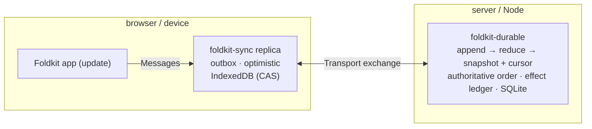

# Replicated state: `foldkit-durable` + `foldkit-sync`

`foldkit-agent` projects an application's **Message** union to agents. The same
union, sent over a durable ordered log, also supports **offline**, **multiplayer**,
and **remote-agent** state. This guide explains the two packages that do it, and
when you want them.

- [`foldkit-durable`](../packages/durable) — the **server-side log**.
- [`foldkit-sync`](../packages/sync) — the **client-side replica**.

They meet over one small transport protocol. Either can be used without the
other.

## The problem

A normal Foldkit app already has the right shape:

```text
Model = state      Message = interaction vocabulary      update = transition
```

If every interaction instead does a `fetch`, the usual things go wrong:

- the UI blocks on the network, or you build optimistic UI by hand;
- a retry or a double-submit can apply the same change twice;
- two devices overwrite each other by last-arrival;
- a server restart loses work that was in flight.

The fix is to treat Messages as **ordered, idempotent, replayable operations**,
and to keep a durable authoritative order on the server.

## How they fit together



The seam is one request. The replica sends its `cursor` and `pending`
operations; the server answers with committed operations since that cursor, an
optional `checkpoint` (when compaction has dropped the tail it would need),
acknowledgements, and rejections. The server is a Foldkit application too: it
decodes each operation's Message and applies the same policy.

## What is shared, and what stays local

`foldkit-sync` replicates a projection, not the whole Model:

```text
Model
 ├── shared fields   → Projection.pick(App.fields.todos)          replicated
 └── local fields    → selectedTodoId, transient errors           never leaves the device
```

`shared` is a writable projection that names the replicated slice, and
`durable` is the `MessageSet` of Messages that replicate. Replay is derived from
the application's own `update` on that slice, and it refuses a durable Message
that returns a Command or writes outside the projection, naming the Message and
the fields. A Message that needs an effect stays local and emits a durable fact
once the effect settles: `RequestedTodo` runs the Command; `SubmittedTodo` is
what replicates. Your `update` remains the only reducer.

## `foldkit-durable`

A durable, ordered log with a snapshot and cursor per document key, backed by
SQLite through `effect/unstable/sql`.

```ts
const journal = yield* Journal.make({
  file: Config.succeed('journal.sqlite'),
  operation: Codec.fromSchema(Operation),                // or a { encode, decode } pair
  snapshot: Codec.fromSchema(Shared),
  empty: () => ({ todos: [] }),
  reduce: (shared, message) => replay(shared, message),  // pure and deterministic
  opId: operation => OpId.make(operation.opId),          // idempotency key
  actorId: principal => ActorId.make(principal.actorId), // trusted actor
  validate, authorize,                                   // policy before commit
})
```

With a sync contract, `...TodoSync.journalContract()` supplies the codecs, the
empty snapshot, the reducer, and the `authorize` rules, so none is written
twice.

As a service rather than a scoped value, `Journal.define<Operation, Snapshot,
Principal>('app/todos')` fixes the types once and hands back the tag and the
layer constructor that agree on them, so the two cannot drift apart.

It owns storage and ordering only, and gives you:

- **Idempotent append.** A repeated `opId` is answered from the log; reusing it
  with different data is an `IdentityConflictError`. Retries are safe.
- **Stable, gap-free order.** Each commit gets the next `sequence`; `read(key,
  after)` returns what changed since a cursor, or fails with
  `CompactedCursorError` once the floor has passed `after`, so a caller adopts a
  checkpoint rather than a partial tail.
- **Snapshot + cursor written atomically**, so a replica can catch up from a
  cursor or adopt a `checkpoint`.
- **Compaction** drops old payloads below a floor without changing what replaying
  the prefix produces. Identity rows and effect records are never garbage-collected,
  so bounding storage means rotating the journal and refusing retries older than
  the retained window (see [Retention](../packages/durable/README.md#retention)).
- **A change stream** (`journal.subscribe`) and **metrics** (`journalMetrics`).
- **`runEffect(key, run)` — recorded effect outcomes.** Reuses successful results
  and coalesces concurrent calls within one journal instance. A crash after an
  external action but before recording success can repeat the action on retry.
  Use stable document/operation/effect identities and provider idempotency;
  see the [effect recovery policy](../packages/durable/README.md#effect-recovery).
- **`recover({ key, from, intents, onUnresolved })` — a recovery worker.** Runs
  the effect intents of a document's committed operations after a cursor,
  reusing recorded successes and stopping at the first intent that failed or
  was skipped, and returns the cursor up to which everything settled. The
  application owns discovery and scheduling; `unfinished()` and `clearEffect`
  remain the primitives underneath.
- **Migrations**, and branded `DocumentId` / `OpId` / `ActorId` / `Sequence` /
  `Cursor`.

**Use it when** a server must sequence operations from many clients, replay or
compact them, and retain effect outcomes.

## `foldkit-sync`

A local-first replica: the UI writes locally and never waits on the network, and
the replica reconciles with the server's authoritative order.

```ts
const App = Surface.application({ Model, Message, initial, update })
const TodoSync = Sync.forApplication(App).make({
  documentId: DocumentId.make('todos'),
  shared: Projection.pick(App.fields.todos),
  durable: MessageSet.make(App, [Message.CreatedTodo, Message.RenamedTodo]),
})

const storage = yield* Sync.indexedDb('todos-tab-1')
const replica = yield* TodoSync.openReplica(ReplicaId.make('tab-1'), storage)
yield* replica.submit(Message.CreatedTodo({ id, title: 'Milk' }))      // instant, local
yield* Effect.provide(replica.synchronize, Sync.transport.socket({ url })) // reconcile
```

`Sync.forApplication` derives the shared projection, the durable subset, the
initial snapshot, and replay from one application declaration; `Sync.define`
remains the protocol primitive it compiles to. `TodoSync.journalContract()` gives
the server's journal the same operation and snapshot codecs, empty snapshot, and
reducer, so the client and server never declare the shared state twice.

In a browser, `Sync.mount` runs the application over the replica with one
reducer: a durable Message applies through `update` at once and persists
afterwards, and the shared slice is re-installed from the replica when an
exchange or a rejection changes it. The mount also routes the URL (`url: {
init, onUrlChange }`, where a `foldkit-mirror` plugs in) and returns the host an
agent binds to; [Runtime binding](./sync-runtime-binding.md) records what it
guarantees.

It owns:

- **A derived contract** (`Sync.forApplication`): one application declaration
  produces the writable projection, the durable Message subset, the initial
  snapshot, and the durable journal contract. `Projection.pick` builds the
  projection; only the declared Messages reach durable state. A large
  application declares one **fragment** per feature and composes them into one
  document; a field declared twice with a different codec or a Message declared
  durable twice throws.
- **Policy on the contract.** `authorize` rules are declared per durable variant,
  with the Message typed as that variant, and compile into the journal
  contract, so the server enforces them inside the append transaction. A
  refused operation is a rejection the replica rolls back. Returning
  `{ allowed: false, reason }` instead of `false` carries the reason onto
  `OperationRejectedError`, so the client can say which rule refused rather
  than only that something did.
- **A persisted outbox and optimistic projection.** `submit` replays the Message
  first and writes it locally only if replay accepts it; `replica.shared` shows
  the change immediately without replaying the outbox again.
- **Reconciliation.** `synchronize` applies the committed order, drops
  acknowledged and rejected entries, and adopts checkpoints. Edits made during a
  pull are rebased onto remote changes rather than lost.
- **Strict decoding.** Every operation and committed operation is validated
  against your Message Schema, with excess fields rejected.
- **A pluggable transport** (`Transport`): loopback, a promise bridge, or a
  reconnecting WebSocket that re-sends in-flight frames with their original ids
  and bounds its queue.
- **Ephemeral presence** (`createPresence`, `createPresenceHub`): a TTL'd peer
  registry for state that must not be logged — cursors, "typing", selections —
  with a required `decodeValue` at the boundary, over a loopback or socket
  channel.
- **`lwwRegister`** for a field whose winner should be logical time, not
  reconnect order.

**Use it when** clients must keep working offline and converge later: offline-first
apps, multi-device, collaborative state, or a server-side agent acting on the same
state the user sees.

## Versions and upgrades

Storage format and application data have separate owners:

- **`foldkit-durable`** tracks its SQLite layout with `user_version` and upgrades
  it in one transaction. `CREATE ... IF NOT EXISTS` makes a re-run safe, so an
  interrupted migration completes on the next open. It does not touch your
  Message, snapshot, or effect payloads; migrating those is the application's job.
- **`foldkit-sync`** stamps its persisted replica and clock state with a
  `schemaVersion`. A stored state from a version this build does not understand
  fails with `UnsupportedReplicaVersionError` or `UnsupportedClockVersionError`,
  naming the found and supported versions, and the stored bytes are left
  untouched so the state stays recoverable.

Reconnecting after the server has compacted is not an upgrade: the server sends a
`checkpoint`, the replica adopts the snapshot, and any edit made while offline is
rebased onto it. Pending operations and the clock's high-water mark survive, so a
reconnect cannot reuse a timestamp. A checkpoint behind the replica's cursor is a
`CheckpointRegressionError`.

## Recovery

Failures are tagged errors, and neither package overwrites state it cannot read.
What an application does next:

- **Storage evicted or unreadable.** `openReplica` sees no saved state and
  starts at cursor 0; the first exchange adopts the server's `checkpoint`. Edits
  that were only in the evicted outbox are gone, so keep anything irreplaceable
  outside replica storage and confirm before discarding it.
- **A stale writer.** Storage compare-and-swaps on the saved revision. A second
  replica or tab writing the same storage fails with a `StorageError`
  ("Replica was changed by another writer"), and storage opened for another
  replica is a `WrongReplicaStorageError`; give each tab its own storage and
  `replicaId`.
- **A Message replay refuses.** `submit` fails with a `ReplayError` carrying the
  replay's message (for a derived contract, the Message and the Command or local
  fields it produced) and writes nothing, so the outbox never holds a Message no
  replica could apply.
- **Malformed persisted data.** `InvalidReplicaHistoryError`, `InvalidOutboxError`,
  or a clock `StorageError` means the bytes do not match the schema. The stored
  value is left intact, so the UI can offer a reset instead of silently losing
  history.
- **Unsupported versions.** `UnsupportedReplicaVersionError` and
  `UnsupportedClockVersionError` name the found and supported versions and
  preserve the data. An older build should not open newer storage; upgrade the
  application instead.

## When not to use these

- You don't need persistence or multiple clients — just use the Foldkit runtime.
- You want peer-to-peer CRDT replication — this is **server-ordered,
  single-writer-per-document**; `lwwRegister` is the only merge helper.
- You need the library to migrate your Message schema across versions — it
  detects an unsupported persisted version and stops, but rewriting application
  data is yours to implement.
- You need a general-purpose database — this is an operation log for Foldkit
  Messages. `foldkit-durable` is Node + SQLite; `foldkit-sync` stores through
  IndexedDB, and requires a server that orders operations.

## See it working

[`examples/sync`](../examples/sync) runs the whole path: a SQLite journal,
IndexedDB replicas, a `ws` transport, an agent bound to the shared replica, and a
demo that takes two clients offline, converges them, and replays server-authority
effects through the durable ledger (recorded successes are reused; a crash between
the external action and its record can repeat it — see the durable README).
[`examples/todo-app`](../examples/todo-app) is the same contract mounted in a
browser with `Sync.mount`, two fragments, owner-only `authorize` rules, and a
WebMCP agent over the mount. `pnpm demo` runs both.

The package READMEs — [`foldkit-durable`](../packages/durable) and
[`foldkit-sync`](../packages/sync) — document the full APIs. Server-derived state
is the sibling guide:
[Server-derived state: `foldkit-surface` + `foldkit-remote`](./remote.md).
