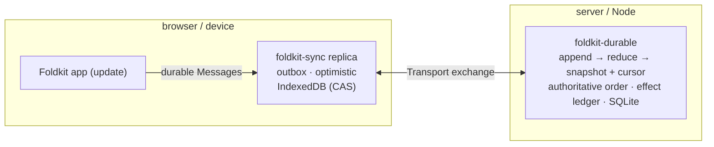

# Replicated state: `foldkit-sync` + `foldkit-durable`

Some Foldkit state should keep working when the network disappears and converge
when several tabs/devices edit the same document. `foldkit-sync` is the
**client-side replica**; `foldkit-durable` is an optional **server-side ordered
log** that can provide the authoritative sequence.

The important part is what they reuse: your application's existing Model slice,
Message variants, and `update`. You do not write a second sync reducer beside the
application.

- [`foldkit-sync`](../packages/sync) — persisted outbox, optimistic local state,
  reconciliation, transport, presence, and browser runtime binding.
- [`foldkit-durable`](../packages/durable) — authoritative operation ordering,
  snapshot/cursor storage, idempotent append, compaction, and durable effect
  outcomes on SQLite.

They meet over one small transport protocol. Either package can also be used
without the other.

## The problem

A normal Foldkit app already has the right shape:

```text
Model = state      Message = interaction vocabulary      update = transition
```

If every interaction instead does a `fetch`, the usual things go wrong:

- the UI blocks on the network, or you build optimistic UI by hand;
- a retry or a double-submit can apply the same change twice;
- two devices overwrite each other by last-arrival;
- a server restart loses work that was in flight.

The fix here is **server-ordered replay**: durable Messages are applied locally
immediately, persisted in an outbox, then reconciled against one authoritative
order. Every replica replays that order through the same application transition.

This is not a peer-to-peer CRDT architecture. If you need every peer to accept
writes independently and merge without a server order, use a different model.

## How they fit together



The seam is one exchange. The replica sends its `cursor` and pending operations;
the server answers with committed operations since that cursor, an optional
`checkpoint` (when compaction has dropped history the replica would need),
acknowledgements, and rejections. With `Sync.forApplication`, the server-side
journal contract is derived from the same application declaration, so the
operation codec, shared snapshot, replay reducer, and authorization rules do not
have to be re-described.

## What is shared, and what stays local

`foldkit-sync` replicates a projection, not the whole Model:

```text
Model
 ├── shared fields   → Projection.pick(App.fields.todos)          replicated
 └── local fields    → selectedTodoId, transient errors           never leaves the device
```

`shared` is a writable projection that names the replicated slice, and
`durable` is the `MessageSet` of Messages that replicate. Replay is derived from
the application's own `update` on that slice.

That gives derived replay an important guardrail: it refuses a durable Message
whose `update` returns a Command (a live effect cannot be replayed) or changes a
field outside the shared projection (that change would be silently lost). The
error names the Message and the problem.

A Message that needs nondeterminism or an external effect stays local and emits
a durable fact once the effect settles:

```text
RequestedChargeCard  -> Command / provider call      local intent
CardCharged           -> durable Message              replayable fact
```

Your `update` remains the only application reducer.

## `foldkit-durable`: the ordered server log

A durable, ordered log with a snapshot and cursor per document key, backed by
SQLite through `effect/unstable/sql`.

```ts
const journal = yield* Journal.make({
  file: Config.succeed('journal.sqlite'),
  operation: Codec.fromSchema(Operation),                // or pass the Schema.Codec directly
  snapshot: Codec.fromSchema(Shared),
  empty: () => ({ todos: [] }),
  reduce: (shared, message) => replay(shared, message),  // pure and deterministic
  opId: operation => OpId.make(operation.opId),          // idempotency key
  actorId: principal => ActorId.make(principal.actorId), // trusted actor
  validate,
  authorize,
})
```

With a sync contract, `...TodoSync.journalContract()` supplies the codecs, empty
snapshot, reducer, and `authorize` rules, so those definitions do not drift
between client and server.

As a service rather than a scoped value,
`Journal.define<Operation, Snapshot, Principal>('app/todos')` fixes the types
once and returns the matching tag and Layer constructor. That avoids a service
key being read back later with unrelated generic arguments.

It owns storage and ordering only, and gives you:

- **Idempotent append.** A repeated `opId` is answered from the log; reusing it
  with different data is an `IdentityConflictError`. Retries are safe.
- **Stable, gap-free order.** Each commit gets the next `sequence`; `read(key,
  after)` returns what changed since a cursor, or fails with
  `CompactedCursorError` once the floor has passed `after`, so a caller adopts a
  checkpoint rather than a partial tail.
- **Snapshot + cursor written atomically**, so a replica can catch up from a
  cursor or adopt a `checkpoint`.
- **Compaction** drops old payloads below a floor without changing what replaying
  the prefix produces. Identity rows and effect records are not garbage-collected
  by compaction, so bounding storage means choosing a retention/rotation policy;
  see [Retention](../packages/durable/README.md#retention).
- **A change stream** (`journal.subscribe`) and **metrics** (`Journal.metrics`).
- **`runEffect(key, run)` — recorded effect outcomes.** Reuses successful results
  and coalesces concurrent calls within one journal instance. A crash after an
  external action but before recording success can still repeat the action on
  retry, so pair stable identities with provider idempotency.
- **`recover({ key, from, intents, onUnresolved })` — a recovery worker
  primitive.** It replays effect intents after a cursor, reuses recorded
  successes, stops at the first unresolved intent, and returns the cursor up to
  which everything settled. The application still owns discovery and
  scheduling.
- **Migrations** and branded `DocumentId` / `OpId` / `ActorId` / `Sequence` /
  `Cursor` values.

**Use Durable when** a server must sequence operations from many clients, replay
or compact them, and retain enough effect information to recover safely.

## `foldkit-sync`: the local-first client

A replica writes locally first and reconciles later. The UI does not wait for a
round trip before showing its own edit.

```ts
const App = Surface.application({ Model, Message, initial, update })

const TodoSync = Sync.forApplication(App).make({
  documentId: DocumentId.make('todos'),
  shared: Projection.pick(App.fields.todos),
  durable: MessageSet.make(App, [Message.CreatedTodo, Message.RenamedTodo]),
})

const storage = yield* Sync.indexedDb('todos-tab-1')
const replica = yield* TodoSync.openReplica(ReplicaId.make('tab-1'), storage)

yield* replica.submit(Message.CreatedTodo({ id, title: 'Milk' }))

yield* Effect.provide(
  replica.synchronize,
  Sync.transport.socket({ url }),
)
```

The edit flow is:

```text
Message
  │
  ├─ replay through application update -> optimistic shared state now
  ├─ persist to local outbox
  └─ exchange later -> server order / ack / rejection
                         │
                         ▼
                    rebase local pending edits
```

`Sync.forApplication` derives the shared projection, durable subset, initial
snapshot, and replay from one application declaration. `Sync.define` is the
lower-level protocol primitive for a non-Foldkit client or a hand-written
projection. `TodoSync.journalContract()` is the server seam.

In a browser, `Sync.mount` runs the application over the replica with one
reducer: a durable Message applies through `update` at once and persists
afterwards, and the shared slice is re-installed from the replica when an
exchange/rejection changes it. The mount also routes the URL (where a
`foldkit-mirror` URL mirror can plug in) and returns the `model`, `dispatch`,
`subscribe`, and `observe` host an Agent runtime needs. [Runtime
binding](./sync-runtime-binding.md) documents those guarantees.

Sync owns:

- **A derived contract** (`Sync.forApplication`): writable projection, durable
  Message subset, initial snapshot, replay, and the journal contract. Large
  applications can declare feature fragments and compose them into one document.
- **Policy on durable variants.** `authorize` rules compile into the journal
  contract and are enforced inside append. A rejection rolls the optimistic
  operation back; `{ allowed: false, reason }` carries a user-facing reason.
- **A persisted outbox and optimistic projection.** `submit` replays first and
  only writes the outbox if replay accepts the operation.
- **Reconciliation.** `synchronize` applies the committed order, drops
  acknowledged/rejected entries, adopts checkpoints, and rebases edits made
  during the exchange.
- **Strict decoding.** Persisted and remote operations are validated against the
  Message Schema, including excess-field rejection.
- **A pluggable `Transport` service**, with helpers under `Sync.transport.*` for
  loopback, promise clients, and reconnecting WebSockets.
- **Ephemeral presence** under `Sync.presence.*`: `Sync.presence.make` creates a
  TTL'd peer registry and `Sync.presence.hub` the server fan-out; socket and
  loopback channel helpers live in the same namespace. Presence is deliberately
  outside the durable log.
- **Logical last-writer-wins fields** through `Sync.lww.register` and a persisted
  `Sync.lww.openClock` when server arrival order should not choose that field's
  winner.

**Use Sync when** clients must keep working offline and converge later:
offline-first apps, multi-device state, collaboration under a server order, or a
server-side agent acting on the same state the user sees.

## Versions and upgrades

Storage format and application data have separate owners:

- **`foldkit-durable`** tracks its SQLite layout with `user_version` and upgrades
  it transactionally. It does not migrate your Message, snapshot, or effect
  payloads; application-data migration remains yours.
- **`foldkit-sync`** stamps persisted replica and LWW-clock state with a
  `schemaVersion`. Data from an unsupported version fails with
  `UnsupportedReplicaVersionError` or `UnsupportedClockVersionError` and is left
  untouched so recovery/reset can be explicit.

Reconnecting after the server has compacted is not an application upgrade. The
server can send a `checkpoint`; the replica adopts its snapshot and rebases
pending offline operations onto it. A checkpoint behind the replica's cursor is
a `CheckpointRegressionError`.

## Recovery

Failures are tagged errors, and neither package silently overwrites state it
cannot understand:

- **Storage evicted or absent.** A replica starts at cursor 0 and catches up from
  the server; edits that existed only in an evicted outbox cannot be recovered.
- **A stale writer.** Storage compare-and-swap detects two writers to the same
  replica storage. Give each tab/replica its own storage identity.
- **Replay refuses a Message.** `submit` fails with `ReplayError` and writes
  nothing, so the outbox cannot contain an operation the derived replay would
  reject.
- **Malformed persisted data.** Decode errors leave the stored bytes intact so
  the UI can offer an explicit reset rather than silently losing history.
- **Unsupported versions.** The version errors name what was found and supported;
  upgrade/migrate instead of opening newer storage with an older build.

## When not to use these

- You do not need persistence or multiple clients — use the ordinary Foldkit
  runtime.
- You want peer-to-peer CRDT replication — this is **server-ordered,
  single-writer-per-document**; `Sync.lww.register` is a field-level merge helper,
  not a general CRDT system.
- You expect the library to migrate your application Message/snapshot schema —
  it protects storage format, but application data migration is application
  policy.
- You need a general-purpose database — Durable is an operation journal, not an
  ORM/database abstraction.

## See it working

[`examples/sync`](../examples/sync) runs the focused path: a SQLite journal,
replicas, WebSocket transport, presence/LWW primitives, and an agent over shared
state. [`examples/todo-app`](../examples/todo-app) mounts the same ideas in a
browser with `Sync.mount`, two fragments, authorization rules, Mirror, and a
WebMCP agent.

The package READMEs — [`foldkit-sync`](../packages/sync) and
[`foldkit-durable`](../packages/durable) — are the API references. For
server-owned disposable data rather than client-authored replicated data, read
[Server-derived state](./remote.md).